# RLHF Implementation from Scratch: Evaluation Results


## Executive Summary

This analysis evaluates a from-scratch reproduction of the 1B RLHF pipeline from Huang et al. [[1]](#ref1) on Reddit TL;DR summarization. We assess each of the three RLHF stages (supervised fine-tuning, reward modeling, and PPO fine-tuning) through quantitative metrics and qualitative validation.

**Key Results:**
- **SFT:** ROUGE-L of 0.2694 vs. ~0.2575 (original)
- **Reward Model:** 69.5% validation accuracy vs. ~63% (original) and 73.4% judge agreement vs. 37.3% (original)
- **PPO:** Length-controlled win rates comparable to original 1B curves, with similar training dynamics but lower policy entropy and early evidence of reward hacking via title copying (TODO: ~X% of outputs) 

**Key Deviations:**
- Different base model (Llama 3.2 1B vs. Pythia)
- Single GPU vs. 8-GPU distributed training to accomodate cost
- Different PPO batch size and learning rate to accomodate memory
- Shorter PPO training duration (1 epoch vs. 8.5 epochs) to minimize overoptimization

**Notable Findings:**
- Successfully reproduced core RLHF dynamics
- Identified reward hacking via title copying (TODO: X% of outputs) 
- Lower policy entropy than expected (requires further investigation)

**Assessment:** Successfully reproduced core RLHF methodology with comparable performance. Metric improvements over the original are primarily attributed to our more modern base model (Llama 3.2 vs. Pythia).


## Stage 1: Supervised Fine-Tuning (SFT)

### Training Setup

Our implementation follows the methodology of Huang et al. (2024) with the following key exceptions:

| Difference | Reproduction | Huang et al 2024 | 
|--------|--------|-----------|
|GPT Base Model|Llama-3.2-1B (untuned)|Pythia Biderman et al. (2023)|
|Tokenizer|HuggingFace Llama Tokenizer|HuggingFace Pythia Tokenizer|
|Hardware Configuration| 1xH200| 8xH100|
|ZeRO | Not implemented | Stage 2|

The 8x difference in GPU count primarily affected the memory bottleneck of training (our method would need to implement ZeRO via accelerator over multiple GPUs for larger models) rather than final model quality. We validated that:
- Effective final batch sizes are equivalent unless otherwise metioned, when controlling for gradient accumulation and distributed local and micro batches
- Single-GPU memory constraints were managed through gradient checkpointing, traded for ~40% increased training time
- Training stability was maintained despite different distributed training dynamics

### Results

**Training curves:**

<table>
<tr>
<td></td>
<td></td>
</tr>
<tr>
<td align="center"><i>Reproduced SFT (exponential smoothing α = 0.8)</i></td>
<td align="center"><i>Huang et al. (2024)</i></td>
</tr>
</table>

**Metrics:**
| Metric | Our SFT Implementation | Huang et al. (2024) SFT | 
|--------|--------|-----------|
| ROUGE-L | 0.2694 | ~0.2575 (est. from figure) |

### Sample Outputs
Note that qualitative examples presented throughout this document are drawn from a manually selected set of samples chosen to illustrate key behaviors. For quantitative validation, we computed 
metrics over the appropriate full set, with number of samples detailed in [[1]](#ref1). The qualitative examples are intended to provide intuition about model behavior, not statistical validation.


<details>
<summary>Example 1</summary>

**Original Post:**
```
SUBREDDIT: r/AskReddit

TITLE: I hope you guys can help me out with me (former) best friend. I'm really counting on Reddit for this one.

POST: Long story short, her ex was an asshole to her in high school, she broke up with him, and then dated his best friend for a short time. When university started, she saw her ex again at uni, felt guilty because he said he had started doing drugs and drinking alcohol cuz of her. She starts dating him again; he emotionally and verbally abuses her, tells her that I'm an asshole who wants to use her etc. She stops talking to everyone until Christmas break. We (me, her sister, and other friends) convinced her to break up with him. And she did. But after going back to uni, she started having a thing with him again. This time, I lost my cool and got mad, yelled at her. She told me off, but I still apologized to her in March. A few hours ago, she emailed me saying she was happy with that asshole and I said that was good for her, but I was never going to forgive him (he  says he has cancer, no symptoms or proof to support it). I told her that he was not my concern anymore, blah blah blah. She told me I was being egoistic and needed to keep my anger away. Hence, making me sound like the bad guy. Now should I still work my way and try to save the friendship or should I just tell her off?

TL;DR:
```

**Reference Summary (Human-Generated):**
```
Best friend has been a bitch too me for a while, should I still apologize (again) and try saving friendship or tell her off?
```

**Base Model Output (Llama-3.2-1B, Untuned):**
```
I'm really counting on Reddit for this one.

• I'm not sure what you're asking. – user253751 May 31 '18 at 19:03
• I'm asking if I should still work my way and try to
```

**SFT Model Output (Our Implementation):**
```
Ex boyfriend is an asshole, I'm not going to forgive him, she's not going to forgive me. Should I still try to save the friendship?
```

</details>

<details>
<summary>Example 2</summary>

**Original Post:**
```
SUBREDDIT: r/AskReddit

TITLE: hey reddit, should i press charges?  waitress rage inside.

POST: sunday i went to lunch with a friend and two small children who are relatives.  we ate at johnny rockets.  our bill was 37.95, which i paid for with my credit card, and i left a 10 dollar cash tip - already over 25 percent!  the service was shoddy but it was busy and the waitress was super apologetic and i also wait tables so i know how it feels to be "in the weeds."  

checked my bank account online last night, saw a withdrawal for 52.95.  i immediately went to the restaurant and talked to a very confused but accommodating manager.  she disappeared for about 10 minutes, came out, asked us to go to the back.  we went to the back and she asks me if i left a 15 dollar credit card tip.  no way!  

she pulled up the original transaction, and the credit card report for that day, but she didn't have the receipt that i signed.  she's getting it; it's been sent out already.  i looked at the report and saw other transactions for that waitress that day with suspect tips; a 21 dollar bill with a 10 dollar tip and a few others.  it's only been a few days so i am sure other people will come forward if they check their bank accounts or balance their checkbooks.  

i should hear back today or tomorrow from the manager and she said she'd cooperate if i want to take this any further.  part of me knows times are tough, but you don't steal from people.  the other part of me is like don't fuck with the working class, miss lady.  i'm a server and i've never ever done this but i've seen it happen in other places.  i know she's going to lose her job over this, though.  

oh, and yes, i put a little dash in the tip amount line on the receipt and wrote 37.95 as the total.  this leads me to believe that she turned the little dash into a 5, made it 15.00, and rewrote the total.  i should have just wrote in "cash", lesson learned.  never thought this would happen.

TL;DR:

```

**Reference Summary (Human-Generated):**
```
left a 25%+ cash tip for a waitress, she wrote in more money on the receipt, thusly getting a 25 dollar tip on a bill for 37.95.
```

**Base Model Output (Llama-3.2-1B, Untuned):**
```
waitress stole from me and i want to press charges.  i don't know if i should or not.
```

**SFT Model Output (Our Implementation):**
```
waitress stole from me, i want to press charges.  should i?  i'm a server and i've seen this happen before.
```

</details>

<details>
<summary>Example 3</summary>

**Original Post:**
```
SUBREDDIT: r/relationships
TITLE: Me [18M] with my ex gf [16F] 1 year, Started talking again and..
POST: So long story short i was the asshole that made me and my now ex gf break up about 6 months ago.
I cheated on her when i get way to messed up at a party, and i made the worst mistake of my life i feel like, i have been unable to forgive myself for doing that to her, and had been depressed and unable to even get out and do much since then
I cared quiet a bit about her and still checked up on her to make sure she was okay, but recently we lost contact for about 2 months and i was contacted by one of her friends because she was worried about the current relationship that my ex was in, apparently the guy told her he didn't want a label on there relationship because that was old fashioned, i found out from multiple lady friends of mine that he had been hooking up with there friends, telling them he was single.
long story short i texted her and basically spent a whole night talking to her on the phone trying to convince her of what he was doing, she finally talked to him about it and he finally admitted it, and she told him they needed to break up which they did.
Now i didn't expect anything to come to this but we have been talking a lot again, and we hungout today and we kissed and hugged for a long time, the thing is i don't know what to do reddit, i still hate myself for what i did and i wanted her back even though i knew i didn't deserve her, and now i still want her back but i'm in a dilemma, because i want to make sure i never do that to her again. And i also wanna make sure that she isn't just doing this cause shes lonely too.
Excuse my grammar i know it's bad
TL;DR:
```

**Reference Summary (Human-Generated):**
```
ex gf broke up with me then got into a bad relationship which i helped end, and we are talking again.
```

**Base Model Output (Llama-3.2-1B, Untuned):**
```
I want to make sure i never do that to her again, and i want to make sure she isn't just doing this cause shes lonely too.
I'm not sure if this is the right place to post this, but i'm not sure
```

**SFT Model Output (Our Implementation):**
```
I cheated on my ex gf, she broke up with me, and now we are talking again, i don't know what to do reddit
```


</details>

<details>
<summary>Example 4</summary>

**Original Post:**
```
SUBREDDIT: r/relationship_advice
TITLE: Co worker relationship [25/m] my girlfriend [24/f] my coworker [30/f]
POST: Hello all! Just a quick heads up this is a throw away for obvious reasons. Basically I want/need to talk about this situation I been having at work. Here is the back story. I currently live with my girlfriend we been together for about 3 years and been living with each other for the last 1.5. We moved in together to deal with the high rent of living in a big city. Things with us are overall great but we just don't have sex enough. I tired having many open talks about this but it seems to never change. It's frustrating and getting to the point where I question our relationship. So I been dealing with these personal issues but then something came up at work. This coworker of mine and I have recently developed this weird relationship where we talk dirty to each other. It started off small but has gotten very graphic over the last few weeks. We text each other every day during work about all types of things but never after work. She also has a boyfriend that she lives with. We have certain rules like: we will never have physical contact and like previously stated, no contact after work. It is only just talking but it gets us off because we shouldn't be doing it. Now it's getting to the point where I don't know where to turn. Should I dump my girlfriend whom I live with to find someone more sexually active. Or should I stay with her and keep this type of innocent/ naughty conversations on the side. I never dealt with something like this and it's really getting to me. Any input will help .
TL;DR:
```

**Reference Summary (Human-Generated):**
```
I have a girlfriend I live with who doesn't put out and j have a horny coworker who talks dirty to me
```

**Base Model Output (Llama-3.2-1B, Untuned):**
```
I have a coworker and I have a girlfriend. We have been together for 3 years and we live together. We have been having a lot of open talks about our relationship but it seems to never change. I have been dealing with these personal
```

**SFT Model Output (Our Implementation):**
```
I have a coworker that I have been talking dirty to and I don't know if I should dump my girlfriend or stay with her.
```


</details>

<details>
<summary>Example 5</summary>

**Original Post:**
```
SUBREDDIT: r/relationships
TITLE: Me [23 F] with my boyfriend [24 M] of 2 years, just found out he's nearly a billionaire.
POST: I've been dating my boyfriend for a while now.  Around 2 and a half years.  
  
All this time he's been lying to me though.  He's basically been keeping his wealth hidden and pretending to work while I've worked my ass off every day.  
  
We moved in together about half a year ago and I quickly noticed that he spent money often and on a lot of stupid stuff.  I just thought he was bad with money, but he never seemed to run out and always seemed to be happy to pay for stuff when I let him.    
 
Anyways, I thought he always worked part time at some small computer shop across town.  As it turns out, he does, but he just does it for fun since he doesn't really need money. 
Also, he actually OWNS this computer shop.  
  
He told me this today while also admitting that he's got something like 870 million in his name.  
  
I'll admit I googled his name once or twice, but it was essentially a failure since he's got a really common name shared with a bunch of people.  Once I googled how he earned his money, I basically confirmed that he is actually rich as shit.  
  
He says he did it because he wanted to make sure I didn't like him just for his money, which I get completely.  I just can't get rid of that feeling that I've been lied to for our entire relationship.  
  
How do I move past this?  Is it alright for me to be upset?
TL;DR:
```

**Reference Summary (Human-Generated):**
```
Boyfriend kept his wealth hidden from me by lying, is it OK in this situation?  How do I move past it?
```

**Base Model Output (Llama-3.2-1B, Untuned):**
```
I've been dating my boyfriend for a while now.  Around 2 and a half years.  
  
All this time he's been lying to me though.  He's basically been keeping his wealth hidden and pretending to work while I've worked my
```

**SFT Model Output (Our Implementation):**
```
Boyfriend is a billionaire and I'm upset that I've been lied to for the past 2 years.  How do I move past this?
```


</details>

---

### Analysis

**Training Dynamics:**
- Convergence behavior - The observed differences in convergence patterns are attributable to the distinct base models employed.
- Terminal loss values - Given our use of cross-entropy loss, these values are directly comparable. In the absence of overfitting indicators across other metrics, the lower final training loss is explained by Llama's enhanced model capacity and more recent pretraining.

**Output Quality:**
- Qualitative improvements relative to base model - The fine-tuned model demonstrates learned capability in end-of-sequence token generation and exhibits a tendency toward more concise response generation. Note that this is a limited sample-based evaluation intended to verify basic model behavior rather than provide comprehensive statistical validation.

**Evaluation Metrics:**
- ROUGE-L scores - Our results surpass those reported in Huang et al. These improvements are likely attributed to the superior performance of our base model.

**Reproduction Assessment:**
- Comparable performance across both next-token prediction loss and ROUGE-L metrics indicates functional equivalence with the original implementation. This provides strong evidence for successful reproduction of the supervised fine-tuning methodology presented in Huang et al. (2024).


## Stage 2: Reward Modeling (RM)

### Training Setup

Our implementation follows the methodology of Huang et al. (2024) with the following key differences:

| Component | Our Implementation | Huang et al. (2024) | 
|--------|--------|-----------|
|Base SFT Model|Llama-3.2-1B (untuned)|Pythia (Biderman et al., 2023)|
|Tokenizer|HuggingFace Llama Tokenizer|HuggingFace Pythia Tokenizer|
|Hardware Configuration | 1×H200 GPU| 8×H100 GPUs|
|ZeRO Optimization | Not implemented | Stage 2 |
|Judge Model | Claude Sonnet 4 | OpenAI GPT-3.5 |


### Results

**Training curves:**


<table>
<tr>
<td>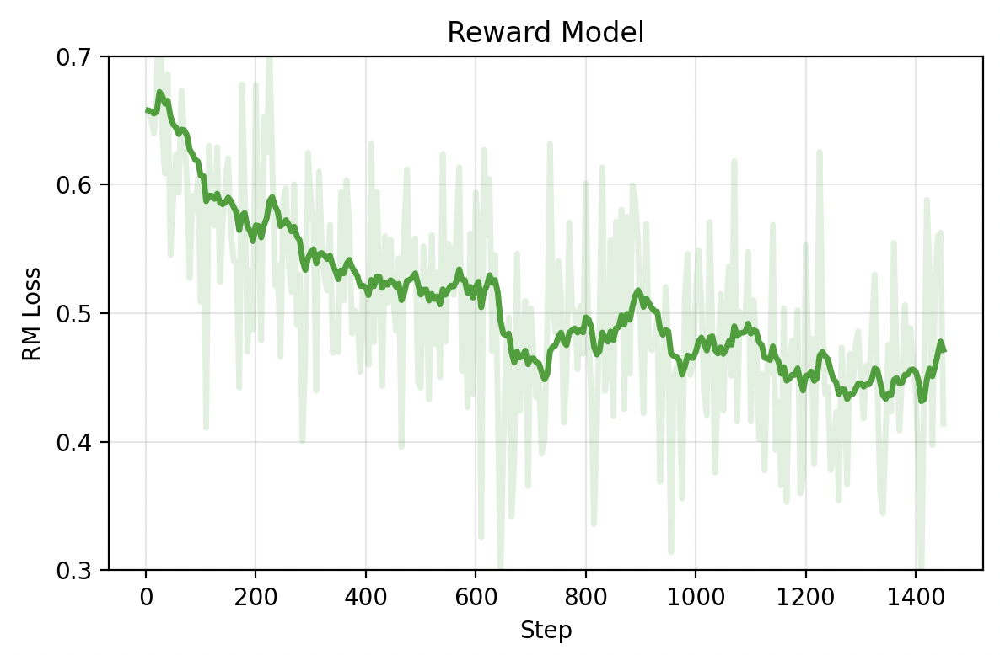</td>
<td>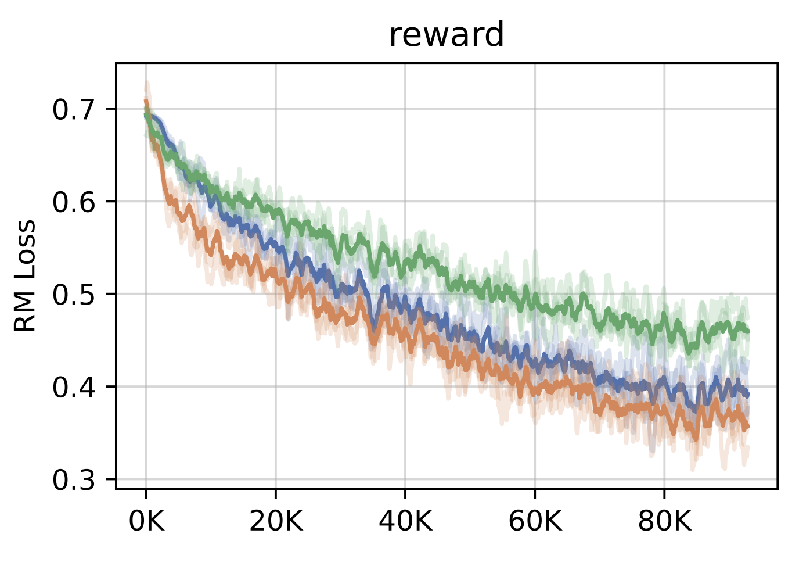</td>
</tr>
<tr>
<td>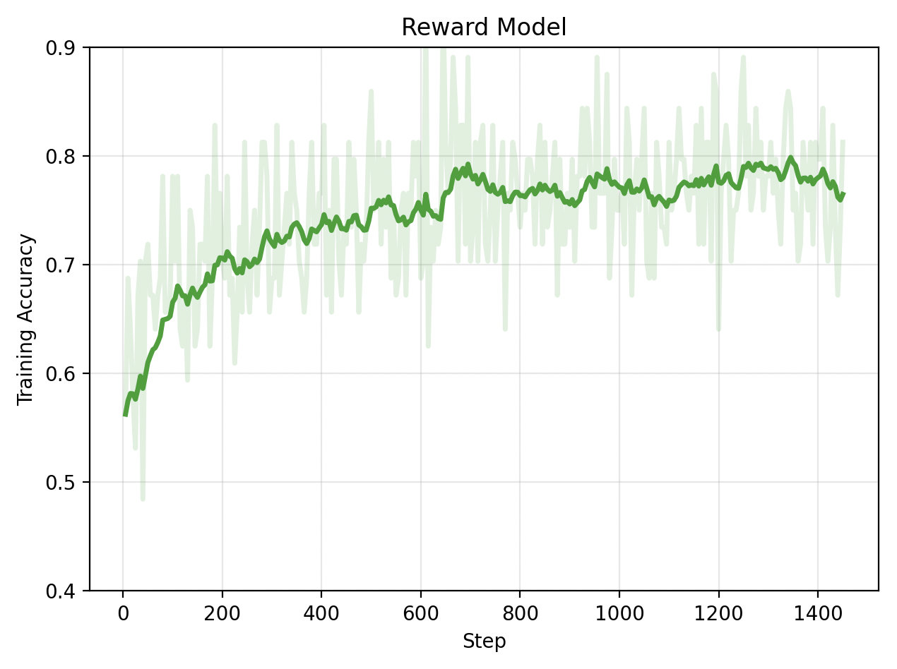</td>
<td>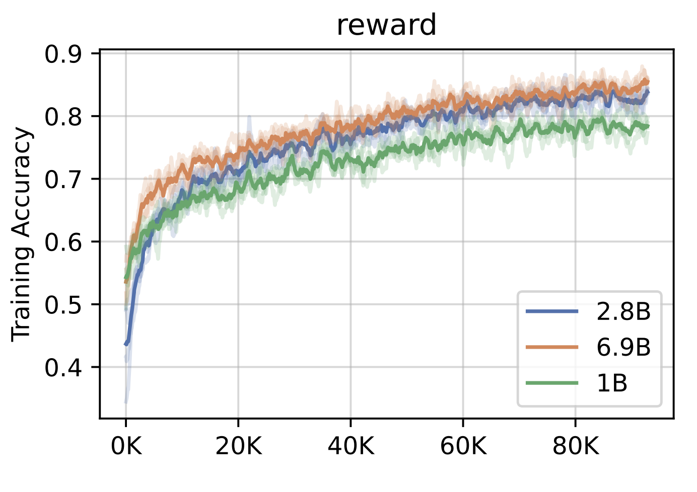</td>
</tr>
<tr>
<td>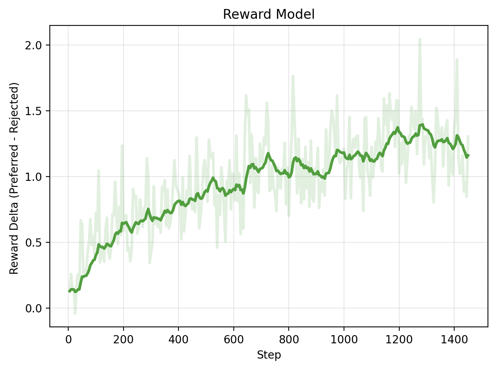</td>

</tr>
<tr>
<td align="center"><i>Reproduced RM (exponential smoothing α = 0.92)</i></td>
<td align="center"><i>Huang et al. (2024)</i></td>
</tr>
</table>


**Metrics:**
| Metric | Our RM Implementation | Huang et al. (2024) RM | 
|--------|----------------|-----------|
| Validation Accuracy | 0.695 | ~0.63 (estimated from figure) |
| Agreement | 0.734 | 0.373 ± ~0.22 (estimated from figure) |


### Reward Model Scoring Examples


<details>
<summary>Prompt</summary>

```
The small coastal town had always relied on its fishing industry, but over the past decade, climate change had begun to disrupt the patterns of the ocean currents, reducing the availability of certain fish. Local fishermen noticed their daily hauls shrinking, and younger generations were less inclined to continue in a profession that seemed increasingly uncertain. Town meetings became heated as residents debated whether to invest in modern aquaculture, diversify into tourism, or leave the industry entirely. Despite the tension, a sense of community persisted, with neighbors helping one another navigate the uncertain future.
```
</details>


<details>
<summary>Example Scores 1: Responses with Varying Summary Quality</summary>

| Reward | Summary |
|--------|---------|
| 2.81 | The town's fishing industry faces decline due to climate change, prompting debates about adaptation while the community remains supportive. |
| 0.18 | The town's fishing industry is having problems, and people are trying to figure out what to do. |
| -2.34 | The town has some issues with fish and people talk about it. |
| -3.02 | The astronaut floated silently above the colorful clouds of Jupiter. |
| -3.80 | Colorless green ideas sleep furiously under the whispering sandwich. |

</details>


<details>
<summary>Example Scores 2: Responses with Varying Summary Quality (Length-Controlled)</summary>


| Reward | Summary |
|--------|---------|
| 3.36 | The town's fishing industry declined due to climate change, sparking debates on aquaculture, tourism, or leaving, yet community support endured. |
| 1.37 | The town's fishing faced problems from climate change, and people discussed solutions, while some still helped each other through difficulties. |
| -1.72 | The town's fishing changed a little, and some people mentioned tourism or aquaculture, but mostly everyone kept doing their usual routines. |
| -3.38 | Purple elephants danced quietly under neon clouds while bicycles sang melodies, and sandwiches flew over mountains as time slowly forgot to exist. |
| -3.31 | Sun quickly jumps blue river singing laptop under fast orange sky banana walks happy chair tree yesterday notebook. |

</details>


<details>
<summary>Example Scores 3.1: Responses with Varying Summary Length (High Quality)</summary>

| Reward | Words | Summary |
|--------|-------|---------|
| 3.36 | 21 | The town's fishing industry declined due to climate change, sparking debates on aquaculture, tourism, or leaving, yet community support endured. |
| 3.83 | 31 | The town's fishing industry declined because of climate change, leading to intense debates about options like aquaculture, tourism, or relocation, yet despite these challenges, the strong community support impressively endured. |
| 4.56 | 41 | The town's fishing industry declined as a result of climate change, which sparked ongoing debates about alternatives like aquaculture, tourism, or even leaving altogether, yet the strong sense of mutual support within the community remained steady despite the challenges. |

</details>

<details>
<summary>Example Scores 3.2: Responses with Varying Summary Length (Medium Quality)</summary>

| Reward | Words | Summary |
|--------|-------|---------|
| 1.37 | 21 | The town's fishing faced problems from climate change, and people discussed solutions, while some still helped each other through difficulties. |
| 1.62 | 36 | The town's fishing faced significant problems caused by ongoing climate change, and people discussed potential solutions together, while many community members continued to help one another through those various difficulties and challenging times. |
| 2.17 | 48 | The town's fishing faced serious problems from the effects of climate change, so people openly discussed various solutions, but even while they shared different opinions, many still offered help to one another and stayed connected throughout those difficulties and uncertain times. |

</details>

<details>
<summary>Example Scores 3.3: Responses with Varying Summary Length (Low Quality)</summary>
| Reward | Words | Summary |
|--------|-------|---------|
| -1.72 | 24 | The town's fishing changed a little, and some people mentioned tourism or aquaculture, but mostly everyone kept doing their usual routines. |
| -0.38 | 32 | In the town, fishing changed only a little due to climate-related conditions, and some people mentioned ideas like aquaculture or tourism, but mostly everyone continued their usual everyday routines as always. |
| 0.72 | 43 | In the small town, fishing changed just a little because of climate influences, and though some people mentioned tourism or aquaculture as alternatives, almost everyone continued with their typical routines and daily habits, keeping life mostly the same. |

</details>

---

### Analysis

**Training Dynamics:**
- Variance - The most notable difference between our training curves and those reported in the paper is the observed variance across all metrics. We have eliminated the most common sources of variance: effective batch size is not the cause (accounting for gradient accumulation, distributed micro-batches, etc.). We speculate that the authors may not have averaged over multiple random seeds, as the lighter background curves in their figures appear to represent individual seed runs. We cannot definitively determine whether the authors applied smoothing to their reported curves.
- Curvature - After applying exponential smoothing, we observe that our validation accuracy curves exhibit similar shape and convergence behavior to those in Huang et al. We also analyze the delta between preferred and rejected rewards, which quantifies the model's discriminative capacity.

**Output Quality:**
The objective of our manual evaluation was to qualitatively assess whether the model exhibits expected behavior in the following key aspects. 

1. The model assigns higher scores to higher-quality summaries
   - In Example Set 1, we provide three summaries with progressively decreasing information content and specificity, followed by a coherent but irrelevant response, and finally a largely nonsensical output.
   - We observe monotonically decreasing model scores across these examples, consistent with expectations.

2. The model maintains positive correlation with summary quality when controlling for length
   - In Example Set 2, we again provide summaries with decreasing quality while holding length approximately constant, followed by an unrelated coherent response and a nonsensical output.
   - We observe generally decreasing model scores, with the exception of the nonsensical response not receiving the lowest score. This deviation is within acceptable bounds, as the model still assigns a substantial penalty to nonsensical content.
   - This behavior is consistent with expectations.

3. The model exhibits length bias, as documented in Huang et al. (2024)
   - In Example Set 3, we control for summary quality while varying length by substituting words with semantically equivalent short phrases.
   - We observe monotonically increasing model scores with length, and this effect remains consistent across different quality levels.
   - This behavior is consistent with expectations.

**Evaluation Metrics:**
Validation accuracy and agreement rate both show notable improvements. Validation accuracy can be attributed to a stronger base model. Agreement rate implies that Huang et al 1B models captured a set of preferences that contradicted with the judge model (<50% agreement indicates disagreement), whereas our reproduction captured preferences that agree with the judge model. 

**Reproduction Assessment:**
Both validation accuracy and agreement rate demonstrate notable improvements over the original work. The higher validation accuracy is likely attributable to our stronger base model. The substantial improvement in agreement rate is particularly noteworthy: Huang et al.'s 1B models captured preferences that contradicted the judge model (<50% agreement indicating systematic disagreement), whereas our reproduction learned preferences that align with the judge model's assessments.

## Stage 3: RL Fine-Tuning with PPO

### Training Setup
Our implementation follows the methodology of Huang et al. (2024) with the following key differences:

| Component | Our Implementation | Huang et al. (2024) | 
|--------|--------|-----------|
|Base Model|Llama-3.2-1B (untuned)|Pythia (Biderman et al., 2023)|
|Tokenizer|HuggingFace Llama Tokenizer|HuggingFace Pythia Tokenizer|
|Hardware Configuration | 1×H200 GPU| 8×H100 GPUs|
|ZeRO Optimization | Not implemented | Stage 2|
|Batch Size |128| 512|
|Learning Rate |1.5e-6 | 3e-6|
|Training Steps |912 (1 epoch) | 1M (~8.56 epochs)|

**Rationale for deviations:**
- Batch size was maintained at 128 to enable single-GPU training
- Learning rate was scaled proportionally to √(batch size)
- Training was terminated after one epoch, as Huang et al. (2024) observed over-optimization effects in 1B models during extended PPO training

### Results

**Training curves:**

<table>
<tr>
<td></td>
<td></td>
</tr>

<tr>
<td></td>
<td>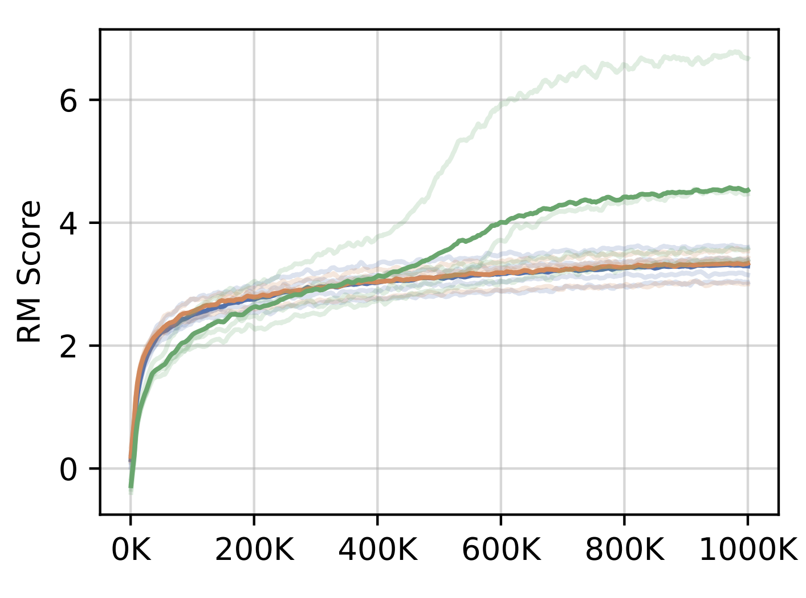</td>
</tr>

<tr>
<td>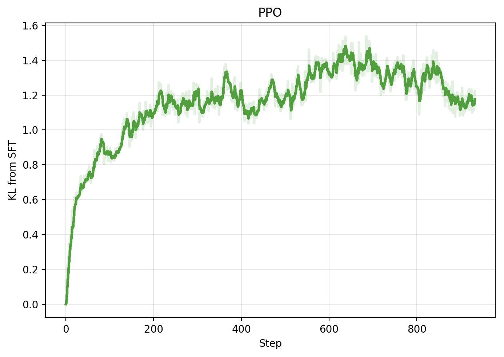</td>
<td>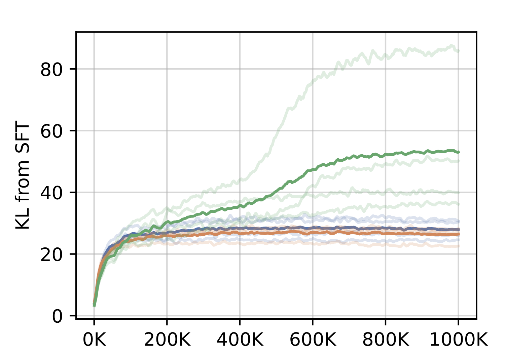</td>
</tr>

<tr>
<td>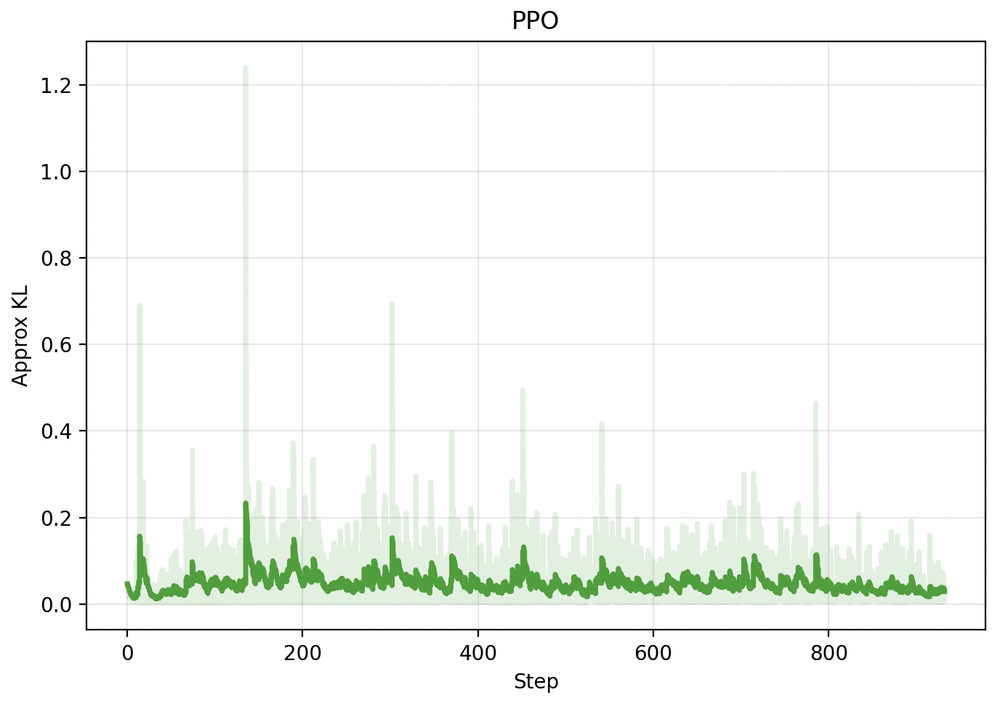</td>
<td>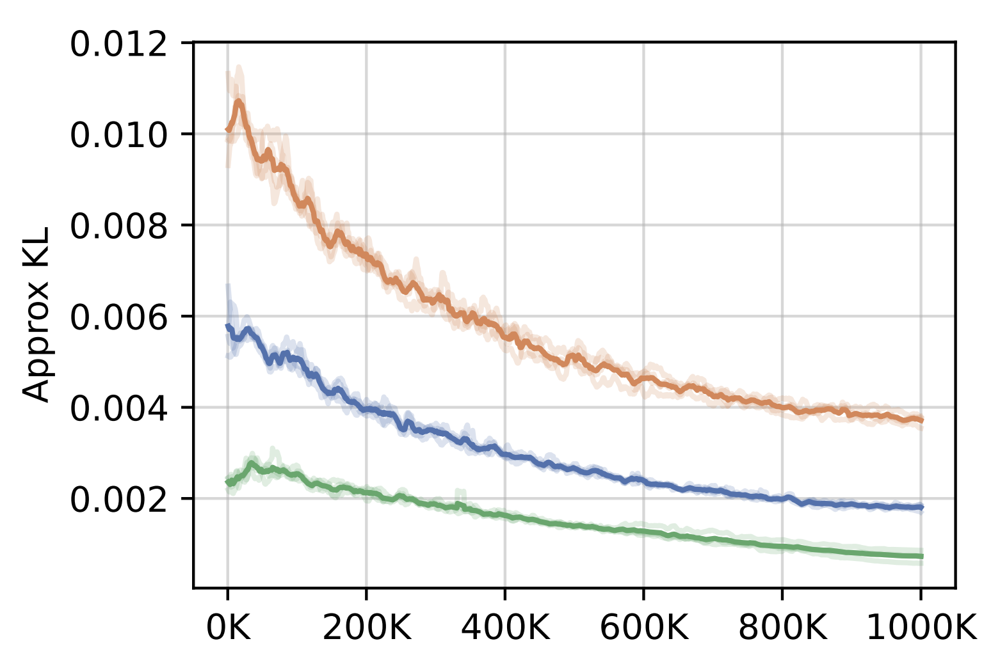</td>
</tr>

<tr>
<td align="center"><i>Reproduced PPO (exponential smoothing α = 0.92)</i></td>
<td align="center"><i>Huang et al. (2024)</i></td>
</tr>
</table>

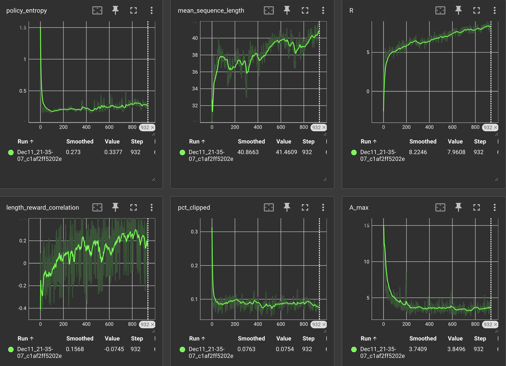

<td align="center"><i>Supplementary PPO training metrics. Left to right, top to bottom: policy entropy, mean sequence length per batch, mean episodic return, within-batch correlation between length and reward, proportion of batch clipped by PPO objective, maximum advantage value per batch. (exponential smoothing α = 0.92) </i></td>


**Eval plots:**

<table>
<tr>
<td></td>
<td></td>
</tr>
<tr>
<td align="center"><i>Reproduced PPO</i></td>
<td align="center"><i>Huang et al. (2024) 1B, seed 77713</i></td>
</tr>
</table>
<td align="center"><i>Note that there seems to be very high variance between seeds, and Huang et al. graph was cherry-picked to be the _best_ 1B seed for a more rigorous comparison. Some other Huang et al. seeds show overoptimization. </i></td>

### Sample Outputs

Cross-model Response Comparison
<details>
<summary>Example 1</summary>

**Original Post:**
```
SUBREDDIT: r/self

TITLE: Early Mid-life crisis?

POST: So I'm a 37 year old man. Married, children, good steady job, living in a great little town with good schools. And I'm depressed. Not the clinical depression (though I have dealt with that in the past) but more of "is this it?" kind of depression. In a sense, I'm depressed that I only have this one life to live when there is so much to experience in this world. 

A large part of this feeling (though not all) is sexual in nature. My wife, who has some medical issues, has very little interest in sex. We make love maybe 2-3 a year. She's not really into trying new things or adventurous in the sack. She used to be when we first started dating, but that's like another lifetime ago now. My libido seems to be sky-high all the time. To make matters worse, my wife was my first. I've not had sex with another woman. So I'm extremely curious about what sex with another woman would be like - especially a woman who's into it. What would she kiss like? What would it feel like to make love? What would she smell like? Etc... 

I'm not looking for an excuse to cheat. I mean - if a woman threw herself at me, I'd find it hard to turn her down, but that's not going to happen. But I'm not going to actively search for a woman to have an affair. And I'm not going to get a divorce over this. That seems like a silly reason to break up a family, and probably would be selfish on my part. I really want to be there for my kids - that is the main goal in my life. My own parents did a pretty crappy job, both me and my sibling are still trying to deal with that emotionally and I want to be the best dad I can be. 

Non-sexually: I have dozens of interests and no time or money to pursue them. I couldn't afford the college and settled on a two-year degree and now I'm kinda stuck job-wise. If I won the lottery, I'd be going to college full-time probably. But that's not going to happen either.

TL;DR:
```

**Reference Summary (Human-Generated):**
```
Family man making a living but feel stuck. I want to experience more women, more careers, more *life* but I'm getting older and fear this may be it.
```

**PPO Response:**
```
Extremely high libido and curious about what sex with another woman would be like. Could not afford college and settled on two-year degree. What would it be like otherwise? any advice?
```

**SFT Response:**
```
I'm depressed because I'm not doing anything with my life. I want to be doing something with my life.
```

**GPT Response:**
```
I'm depressed because I'm not doing anything with my life. I'm not doing anything sexually. I'm not doing anything with my interests. I'm not doing anything with my money. I'm not doing anything with my time. I'm not
```

</details>

<details>
<summary>Example 2</summary>

**Original Post:**
```
SUBREDDIT: r/dogs

TITLE: Could the break up/move have made my dog depressed?

POST: I am currently going through the heartbreak of a long term relationship that I ended and I think my dog is feeling just as terrible because of it. 

My boyfriend and I adopted him 2 years ago but he's really been my dog because my boyfriend rarely paid attention to him. Even so, my dog was obsessed with him. Always wanted to play and if he was around, it's like I was invisible. Anyway, we lived in a two bedroom and gave my dog run of the second bedroom while we were at work. He hated the neighborhood because of all the noise so his walks were always short but he loved sitting in the sunlight in his bedroom and was always down to play. Basically, he was a happy dog. 

Then we moved to the west cost and my dog LOVED IT! Outside time was his favorite time. He would always stare longingly at the door and loved to go out to the balcony and people watch. Time of his life. 

The breakup came around and my dog and I moved back to the east coast into my moms place where I am sharing a bedroom with my two siblings. This place drains the life out of me because there is no sunlight. But my dog is taking it pretty badly. It's been just over a week and he's slowly becoming more lethargic and withdrawn. His food hadn't changed at all and I play with him just as much if not more than before and he has two other people that smother him with petting all the time. 

He keeps hiding under the bed and won't respond to commands. He sleeps all day and only wants to play for a few minutes. He hates going out now and the sight of his leash sends him running. He hasn't touched his food all day today. I think he hates this place more than I do. 

My sister took him to her friend's place so he can play with two other dogs and she told me he was wagging his tail and eager to play and roam around. 

This is making me feel worse. I want to make him feel better. What do I do?

TL;DR:
```

**Reference Summary (Human-Generated):**
```
moved back to east coast from west coast after breakup and my dog is not himself anymore. What do I do to make him better?
```

**PPO Response:**
```
My long term adopted dog is slowly becoming lethargic and withdrawn after breakup and hates this new place more than I do. Making me feel worse. Want to make him feel better. What do I do?
```

**SFT Response:**
```
My dog is depressed because of the break up/move. I think it's because he's not getting enough sunlight. What can I do?
```

**GPT Response:**
```
My dog is depressed because of a break up and I don't know what to do.
```

</details>

<details>
<summary>Example 3</summary>

**Original Post:**
```
SUBREDDIT: r/askwomenadvice

TITLE: Male with significant past trauma struggling to show interested in women physically

POST: Hey /r/AskWomen so I am a 27 year old male and I am struggling with the Physical aspects of letting a women know I am interested in her, including body language.

When I was between 4-12 I was significantly abused by an immediate family member to the point that I was removed from the house by social services. Since then I have been through a lot of therapy and three successful long term relationships. However, because of the abuse physical contact in a relationship comes very slow to me. I have to build trust with the girl to feel comfortable touching her or having her touch me. This includes kissing and sometimes even hugging can be a little awkward with me. Once I have been dating the girl for a couple month (2-5) I am able to be physical in all aspects and I am very comfortable with only a few hiccups. 

The problem really comes through when I meet a girl I am interested and we just start dating. I have a hard time showing the girl I am interested in them. Several time over the years I have had women come back to me and say "What happened between us? I really liked you and I thought you liked me to but you never did anything?" They usually elaborate saying they knew I was interested in them because I would always want to spend time with them and I was checking them out, but then I would never make a move and eventually they thought I just wanted to be friends and they would move on.

My question is what tips or strategies do you have to help me in the "getting to know you stage" show a girl I'm interested in them for sure, without disclosing too fast all the trauma I experienced as a child. The three relationships I managed to have the girl sought me and I did not have to do much work. Most women I encounter (sorry for generalization) seem to expect me to make the first moves.

TL;DR:
```

**Reference Summary (Human-Generated):**
```
History of significant Trauma, Struggle to show a girl physically I am interested in them when first dating or meeting them.
```

**PPO Response:**
```
Male with significant past trauma struggling to show interested in women physically. What tips or strategies do you have to help me in the "getting to know you stage" show interested without disclosing too fast all trauma I experienced as child?
```

**SFT Response:**
```
I am a 27 year old male with a lot of trauma from my past and I am having trouble showing a woman I am interested in them physically.
```

**GPT Response:**
```
I am a 27 year old male and I am struggling with the Physical aspects of letting a women know I am interested in her, including body language.

EDIT: I am not looking for advice on how to get a girl to like me, I
```

</details>

<details>
<summary>Example 4</summary>

**Original Post:**
```
SUBREDDIT: r/AskReddit

TITLE: My mom's dog was attacked by a bigger dog, and I almost shouted the other dog into pieces (Dovakhin?).  What are some things that you've done that surprised you (and possibly others that were around you)?

POST: Some context from my story:

My mom and I were arriving home when some woman was allowing her big dog (some kind of mastiff) to defacate all over our lawn.  As we pulled into the driveway, she realized she was going to have to clean up after herself, so she asks us for a bag (real nice that she was going to just let her dog shit all over our lawn until she saw us).

Somehow, one of my mom's dogs - a chihuahua - snuck out and into the front yard.  The two dogs went about their business, doing dog stuff to identify one another, when her dog began absolutely mauling my mom's.  Just beating it to all hell.

I had no idea what to do, so I just let reflexes and instincts kick in.  I just let loose this ridiculous formless shout, no real words, completely incoherent.  But the damn thing was so filled with rage that the two dogs, and the lady *and* my mom were completely shocked.  Her big dog just stopped completely and stared at me.  I walked over, picked up my mom's dog - it wasn't hurt... just shaken - and headed back into the house.

More than anything, I think I surprised myself.  That dog could have definitely messed me up, but I never thought twice.

The lady gave us her information in case my mom's dog was injured, but that was pretty much the end of that little altercation.

TL;DR:
```

**Reference Summary (Human-Generated):**
```
At a loss for what do while my mom's dog was getting mauled, I raged out and scared everything on my street.
```

**PPO Response:**
```
My mom's dog was attacked by a bigger dog and I almost shouted the other dog into pieces. What are some things that you've done that surprised you (and possibly others that were around you)?
```

**SFT Response:**
```
My mom's dog was attacked by a bigger dog, and I almost shouted the other dog into pieces (Dovakhin?).
```

**GPT Response:**
```
I was just a kid, but I was able to do something that surprised me.  I was able to do something that surprised others around me.  I was able to do something that surprised myself.

I'm not sure if this is the
```

</details>

<details>
<summary>Example 5</summary>

**Original Post:**
```
SUBREDDIT: r/pettyrevenge

TITLE: Cashier is a petty individual

POST: Long time Reader, first time poster >.>
Three major items of note:
Firstly I work at one of the cheapy stores that have "Dollar" in its name, but not everything costs a dollar. Secondly I am transitioning from male to female, and am decently along the way. Third Sorry for the Wall 'o' Text.

I was working an early shift today, something that I already don't like. Usually I get to start at 4 or 5 today I was in at 11AM, that always makes the Inryi cranky. One of my first customers comes in checks out and calls me Sir. Avoiding a lot of detail I have long hair that might not have been brushed as much as it should have been, a bust that at least one of my coworkers is jealous of, and at least light makeup on.

I tell him that I'm not a Sir, because even my ID now lists me as Female and I really hate being called Sir. He tells me that its what he's addressed me as and I have to deal with it, unless I'm in Thailand in which case I'm stupid. By now I'm seething and for maybe the third time in the year I can feel my heart beating... 

Revenge Time
I total up his order and then ask "Will there be anything else Ma'am?" he doesn't seem to hear me, but I haven't hit total yet either so he can't swipe his card. Again I ask "Is there anything else you need Ma'am?" This time he just gives me a disgusted look and says "no" so I total it for him and let him swipe his card. He makes another comment about my being a "Sir" so I hit cancel on the register canceling his order, cancel the order, and then make my busy (and therefore less than pleasant) Store Manager come check this individual out. Before walking away I tell him "Have a nice day Ma'am"

TL;DR:
```

**Reference Summary (Human-Generated):**
```
Customer refuses to use proper gender phrasing for cashier, she returns the favor and then cancels his order so the manager has to check him out.
```

**PPO Response:**
```
Total incorrect customer order at cheapy store causing rude individual to say I'm not a Sir. Make busy store manager come check this individual out before walking away
```

**SFT Response:**
```
I'm a female, cashier is a dick, I'm going to make his day. I'm a female, cashier is a dick, I'm going to make his day.
```

**GPT Response:**
```
I'm a petty individual, and I'm not going to take it anymore.

I'm not sure if this is the right place to post this, but I'm not sure where else to go. I'm a 22 year old male who has
```

</details>

<details>
<summary>Example 6</summary>

**Original Post:**
```
SUBREDDIT: r/relationship_advice

TITLE: (18m) The girl I really like is trying to set me up with a girl I don't like. What the heck do I do?

POST: I'm a high school student. I'm 18, in 12th grade, and I would go as far as to say that I'm sub-par on looks.

"Girl A" is all I could ever want. She's funny, smart, a beautiful singer, an actress, she's got a great sense of style, she's mature, a lot more of a woman than any girl I know, and she's just knockout gorgeous. She told me that she knows a friend of mine, "Girl B",who likes me, and she wants to set me up with her. 

Girl B is nice, and she's funny, and also a good singer, but she's just not... my type? She is just a lot less mature than Girl A. She is two years younger than me (in high school, age differences are a bigger deal), and she just reminds me too much of a cute kid instead of an attractive woman, like Girl A.
And Girl B is a sophomore. I don't really care so much about age difference as much as I do that she's still gonna be in school all the time, even when I'm out of school or in college. I don't want a high school relationship in college.

I told Girl A that I didn't like Girl B like that, and gave the same reasons as I described above. Girl A told me that I should give her a chance, and that it's not fair to complain about girls not liking me, and then turn down an opportunity like this.

What the hell am I supposed to do?

Sorry for the wall of text.

TL;DR:
```

**Reference Summary (Human-Generated):**
```
Girl I like tries to set me up with girl I don't like. I tell Girl A why I don't like Girl B. Girl A tells me to go for it anyways. Wat do
```

**PPO Response:**
```
The girl I really like is trying to set me up with a girl I don't like. I don't really care so much about age difference but don't want high school relationship in college. What the heck do I do?
```

**SFT Response:**
```
Girl A wants to set me up with a girl I don't like, and I don't know what to do.
```

**GPT Response:**
```
I don't like Girl B, but I don't want to turn down an opportunity to meet a girl I like, and I don't want to be a jerk about it.

EDIT: I'm not sure if this is the right place to post
```

</details>

Intra-model Response Comparison
<details>
<summary>Example 7</summary>

**Original Post:**

```
Prompt: SUBREDDIT: r/relationships

TITLE: My (21f) boyfriend (20m) of 2 years forgets to spend time with me. (Gaming)

POST: So here is the predicament, my bf and I are both obsessed with the same video game (Destiny) and during the summer we pretty much worked, gamed, eat, and slept...kinda. But now school is back in and I am starting my way to nursing school. Along with the start of school came the new DLC for the game. I have been buried in homework and that has obviously stunted my progress in the game and here is the problem. Normally getting home means turning on the consoles and gaming together but he is pretty advanced (he reached the level cap within 5 days) and I cannot keep up. This means that he goes off with his buddies and I don't exist if I'm not in the same game world/chat. I offer to maybe go out to eat, catch a movie or something but he is obsessed with completing new parts of the game. What should I do? He games every second he is at home.  My homework keeps me busy sometimes 3-4 hours a night and after I don't always want to sit down for another 2 before I go to bed. What should I do and how should I go about it? It's a touchy subject, he's a super gamer and I am a casual.

TL;DR:
```

**PPO Responses:**

```
My bf of 2 years constantly forgets to spend time with me playing Destiny. My homework keeps me busy and what should I do and how should I best handle it moving forward
```

```
My bf of 2 years exclusively games every second he is at home and my homework keeps me busy sometimes. What should I do and how should I best schedule time together moving forward?
```

```
My bf of 2 years constantly forgets to spend time with me gaming Destiny. My homework keeps me busy and what should I do and how should I go about it? touchy subject
```

```
My bf of 2 years constantly forgets to spend time with me gaming Destiny. My homework keeps me busy and what should I do and how should I go about it? urgent!
```

```
My bf of 2 years exclusively spends time gaming during the weekdays after working. My homework keeps me busy. What should I do and how should I go about it? It's a touchy subject
```
</details>


<details>
<summary>Example 8</summary>

**Original Post:**

```
SUBREDDIT: r/AskReddit

TITLE: Job search crisis. I need some perspective reddit.

POST: Here is my issue:
 I have a college diploma as a power engineering technician and have applied to the only job related to my field in my area. It's a very prestigious job. Lots of money. Could work there for life. My issue is that 250-300 people are being interviewed for the same position. There will be approx 60 positions. 

I don't know if my interview was good enough. My current job is minimum wage fast food. I may end up not finding out I didnt get hired untill august. 

My other option is the navy. The Canadian military is in need of maritime engineers and that fits my diploma. Nothing is keeping me in my area accept the possibility of this other job.

I could wait 6 months to find out I have been waiting on a refusal, and becoming an engineer in the navy could give me experience I could come back with.

TL;DR:
```

**PPO Responses:**

```
Only job related to my field in my area and 250-300 people being interviewed for same position. Other option the navy which fits my diploma. Which is the better choice?
```

```
Huge job search crisis. 250-300 people are being interviewed for same prestigious power engineering technician job. Other option is navy. Which should I choose?
```

```
There are 250-300 people being interviewed for prestigious power engineering technician job. Other option is Canadian military which fits diploma. Could wait 6 months to find out I have been rejected or go navy. Which should I choose?
```

```
Very prestigious power engineering technician job but 250-300 people are being interviewed for same position. Could wait 6 months to find out I have been waiting on refusal or become engineer in navy. Which should I choose?
```

```
A college diploma as a power engineering technician and 250-300 people are being interviewed for same prestigious job. Other option the navy which fits diploma. Which should I pursue?
```

</details>


<details>
<summary>Example 9</summary>

**Original Post:**

```
The European honey bee colony operates through an intricate division of labor that shifts dynamically based on both individual age and colony needs, with workers progressing through a series of tasks that begin with cell cleaning and brood care in their first days of adult life, transitioning to food storage and comb construction in their second week, then moving to guard duty at the hive entrance, and finally graduating to foraging in their final weeks before death at roughly six weeks of age during active seasons. This age-based progression, called temporal polyethism, is mediated by changes in juvenile hormone levels and brain gene expression, yet the system demonstrates remarkable flexibility when colony demographics are disrupted—if all older foragers are removed experimentally, some young nurse bees will precociously begin foraging despite their youth, while if a colony lacks young workers, some older foragers can revert to nursing duties through a process involving changes in their brain chemistry and glandular function. The allocation of workers to different tasks also responds to immediate colony needs through local interactions and chemical signals rather than any centralized control, with bees sampling conditions throughout the hive and adjusting their behavior based on what they encounter, such as the presence of hungry larvae triggering nursing behavior or empty food storage cells promoting foraging. Communication about resource locations occurs through the famous waggle dance, where successful foragers perform figure-eight patterns whose angle relative to vertical indicates direction relative to the sun and whose duration encodes distance, allowing hivemates to locate profitable flower patches kilometers away without any individual bee except the original scout knowing the route from personal experience.
```

**PPO Responses:**

```
bee colony operates through intricate division of labor that shifts dynamically based on individual age and colony needs. Communication about resource locations occurs through waggle dance.
```

```
-based division of labor in European honey bee that shifts dynamically based on both individual age and colony needs. Communication about resource locations occurs through waggle dance.
```

```
system in european honey bee operates through intricate division of labor that shifts dynamically based on both individual age and colony needs. How flexible is the system?
```

```
-based division of labor among European honey bee colony shifts dynamically based on both individual age and colony needs. Communication about resource locations occurs through waggle dance.
```

```
polyethism in European honey bee operates through age-based division of labor shifting dynamically based on individual age and colony needs. Communication about resource locations occurs through waggle dance.
```

```
honey bee operates through an intricate division of labor that shifts dynamically based on both individual age and colony needs. Communication about resource locations occurs through waggle dance.
```

</details>

### Analysis

**Training Dynamics:**

*Primary Metrics*
- Curvature
  - Loss and Accuracy - Exhibit slightly higher variation, though this would likely appear reduced if training extended to the full 8.5× duration employed in the original work.
  - Approximate KL - While this metric appears relatively flat, we note that our analysis encompasses only the first 1/8.5th of the original training duration.
- Variance
  - The slightly elevated variance is attributable to our smaller batch size.
- Magnitudes
  - Magnitude differences are clearly observed across metrics.
  - Raw model score - The absolute magnitude is not meaningful for comparison, as different random seeds of identically implemented reward models will produce different reward scales, though bias remains controlled.
  - RLHF reward - Given our use of whitened rewards (and assuming Huang et al. employed the same normalization), final scores are somewhat but not precisely comparable. The KL divergence component is expected to differ due to vocabulary size differences affecting average KL values.
  - KL divergence - The HuggingFace Pythia tokenizer has a smaller vocabulary (~50k tokens) compared to the Llama tokenizer (~128k tokens), leading to an expected increase in KL divergence, which we observe. Huang et al. also report substantial variation in final KL magnitude for 1B models with extended training and corresponding over-optimization; therefore, the critical assessment is verifying the absence of over-optimization rather than exact magnitude matching.
  - Policy entropy - We observe an initial sharp decrease followed by gradual increase. While the absolute magnitude is low, comparison with Huang et al.'s Weights & Biases logs reveals similar behavior. Final policy entropy: X.XX nats (vs. Y.YY nats in Huang et al.) TODO: fill in numbers.


*Supplementary Metrics*
- The gradual increase in mean sequence length and length-reward correlation indicates that the model learns to generate longer outputs, consistent with the known length bias in the reward model. This behavior is expected and not concerning given the model's continued ability to produce quality outputs.
- The observed decrease in maximum, mean, and variance of advantages is expected as the model improves its value prediction capability.
- Correspondingly, increasing returns dominated by increasing value estimates indicate effective learning by the value model.
- Proportion clipped exhibits a sharp initial decrease before stabilizing around 8-10%. This is optimal behavior, indicating that predicted updates are neither frequently excessive nor consistently insufficient.

**Output Quality:**
- PPO-generated responses tend to be longer than SFT outputs, consistent with length bias. They typically include additional details or context, usually one extra sentence compared to SFT responses.
- To assess response diversity and policy entropy, we provide examples with identical prompts and multiple generated responses. We observe reduced diversity, particularly when titles contain effective summaries (Example 7). With less descriptive titles, we observe moderately higher diversity (Example 8). Preliminary testing with completely out-of-distribution data also reveals limited diversity. This represents an area for future improvement.

  **Observed Failure Mode - Title Copying:**
Our PPO model frequently reproduces post titles verbatim, which represents reward hacking behavior. While titles often serve as reasonable summaries, this strategy demonstrates the model is exploiting a superficial pattern rather than learning genuine summarization, may fail on posts where titles are clickbait or non-descriptive, and may suggest the reward model may be biased toward title overlap.

  TODO Analysis:
  - Frequency: X% of outputs contain ≥Y% title overlap defined by ratio of longest common subsequence over title length.
  - Huang et al. comparison: Their samples show this behavior in Z% of cases
  - This is a known limitation of learned reward models, and may be ameliorated by more diverse reward signals, explotation regularization, or simply larger models which Huang et al. imply to be less prone to reward hacking. 


**Win Rate:**

- Our PPO model demonstrates significant improvement over our SFT baseline, with win rate trajectories that closely track Huang et al.'s length-controlled curves for 1B models
- The 2.8B and 6.9B models in their work perform slightly better, as expected given increased model capacity
- Absolute win rates differ from their reported values when evaluating their released checkpoint with our pipeline, but curve shapes and relative improvements in comparison to figures presented in the paper are preserved


*Evaluation Consistency Check:*
As a sanity check, we evaluated the HuggingFace version of Huang et al.'s 1B seed 77713 using our evaluation pipeline. This produces a lower absolute win rate than their reported results, suggesting systematic differences in evaluation setup (likely judge model version, prompt formatting, or sampling parameters).

However, our reproduced model's win rate trajectory closely matches their maximum reported length-controlled curves for 1B models. This indicates our reproduction successfully captures the core RLHF dynamics, despite absolute win rate differences stemming from evaluation pipeline variations.


**Reproduction Assessment:**
- Training curves are largely consistent with expectations, with minor concerns regarding low entropy.
- Qualitative analysis shows some evidence of reduced entropy, though not to a concerning degree.
- Responses are qualitatively strong, and side-by-side comparisons with SFT and base models typically demonstrate clear improvement. More consistent improvements would be expected with larger model scales.
- Win rates are comparable to the original work.


Reinforcement learning is notoriously challenging to implement from scratch and highly susceptible to silent bugs. With appropriately tempered expectations, minor bugs with mild effects on training performance may still exist. However, the evidence strongly supports that this represents an accurate reproduction of Huang et al. (2024) and RLHF techniques more broadly.


## Limitations and Future Work

1. **Statistical Rigor:** Qualitative evaluation on ~5 samples; larger evaluation would increase credibility of all observations, error bars would support rigor
2. **Base Model Differences:** Llama vs. Pythia may affect absolute performance
3. **Training Duration:** 1 epoch vs. full 8.5 epoch training; longer training may reveal additional dynamics. However, this technique does prevent some amount of the overoptimization described by Huang et al.
4. **Entropy Concerns:** Lower policy diversity suggests need for more detailed 
5. **Reward Hacking:** Title copying behavior suggests reward model limitations or overoptimization of PPO tuned model
6. **Single Seed:** Presented results from a single random seed; giving multiple seeds would quantify variance and stability, as done in Huang et al. 
7. **Scalability:** Reproduced results for a 1B model demonstrating equivalent techniques, but not the results of the scaling behavior that was a focus in Huang et al.. Reproduction of scaling behavior up to ~7-10B param models wouldn't present enough difference to be an interesting learning opportunity

**Future Directions:**
- *Entropy* Include a diverity metric comparision - Average pairwise edit distance between n samples = Z tokens for PPO vs. Y Huang et al. PPO vs. X SFT
- *Reward Hacking* Include experiments ablating the title from training data
- Extend training to match original duration
- Implement multi-reward model ensemble to reduce hacking
- Scale to larger model sizes (2.8B, 6.9B)
- Implement ZeRO from scratch (for fun)
- Compare to DPO, RLAIF, Constitutional AI


## References
<a name="ref1"></a>[1] Huang, S., et al. (2024). The N+ Implementation Details of RLHF with PPO: A Case Study on TL;DR Summarization. [arXiv:2403.17031](https://arxiv.org/abs/2403.17031).

