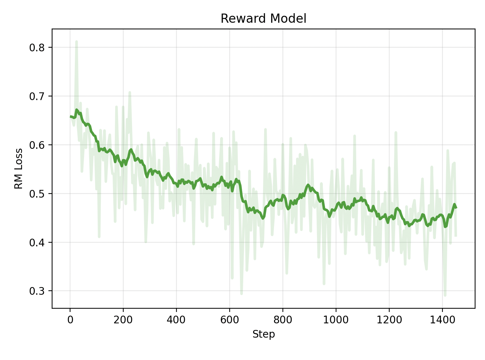
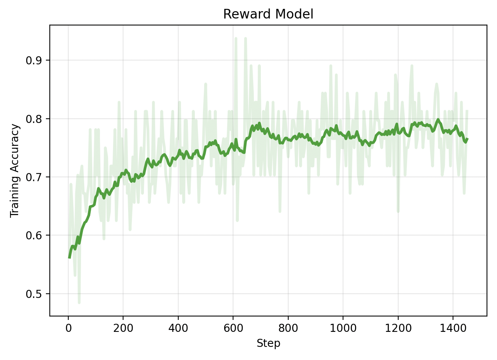

# RLHF Implementation from Scratch: Evaluation Results

## Overview

The goal of this analysis is to verify reproduction of results.

## Stage 1: Supervised Fine-Tuning (SFT)

### Training Setup

Follows Huang et al. 2024. Only differences are:

| Difference | Reproduction | Huang et al 2024 | 
|--------|--------|-----------|
|GPT Base Model|Llama-3.2-1B (untuned)|Pythia Biderman et al. (2023)|
|Tokenizer|HF Llama Tokenizer|HF Pythia Tokenizer|
|Hardware | 1xH200| 8xH100|
|ZeRO | No | Stage 2|


### Results

**Training curves:**

<table>
<tr>
<td></td>
<td></td>
</tr>
<tr>
<td align="center"><i>Reproduced SFT</i></td>
<td align="center"><i>Huang et al. (2024)</i></td>
</tr>
</table>

**Metrics:**
| Metric | Reproduced SFT | Paper SFT | 
|--------|--------|-----------|
| ROUGE-L | 0.2694 | ~0.2575 (est. based on figure) |

### Sample Outputs


<details>
<summary>Example 1 (click to expand)</summary>
**Example 1: [Brief topic description]**

**Original post:**
```
SUBREDDIT: r/AskReddit

TITLE: I hope you guys can help me out with me (former) best friend. I'm really counting on Reddit for this one.

POST: Long story short, her ex was an asshole to her in high school, she broke up with him, and then dated his best friend for a short time. When university started, she saw her ex again at uni, felt guilty because he said he had started doing drugs and drinking alcohol cuz of her. She starts dating him again; he emotionally and verbally abuses her, tells her that I'm an asshole who wants to use her etc. She stops talking to everyone until Christmas break. We (me, her sister, and other friends) convinced her to break up with him. And she did. But after going back to uni, she started having a thing with him again. This time, I lost my cool and got mad, yelled at her. She told me off, but I still apologized to her in March. A few hours ago, she emailed me saying she was happy with that asshole and I said that was good for her, but I was never going to forgive him (he  says he has cancer, no symptoms or proof to support it). I told her that he was not my concern anymore, blah blah blah. She told me I was being egoistic and needed to keep my anger away. Hence, making me sound like the bad guy. Now should I still work my way and try to save the friendship or should I just tell her off?

TL;DR:
```

**Reference summary (human):**
```
Best friend has been a bitch too me for a while, should I still apologize (again) and try saving friendship or tell her off?
```

**Base model (Llama-XXX):**
```
I'm really counting on Reddit for this one.

• I'm not sure what you're asking. – user253751 May 31 '18 at 19:03
• I'm asking if I should still work my way and try to
```

**My SFT:**
```
Ex boyfriend is an asshole, I'm not going to forgive him, she's not going to forgive me. Should I still try to save the friendship?
```

**Paper SFT (GPT-3):**
> Paper's output

</details>

<details>
<summary>Example 2 (click to expand)</summary>
**Example 1: [Brief topic description]**

**Original post:**
```
SUBREDDIT: r/AskReddit

TITLE: hey reddit, should i press charges?  waitress rage inside.

POST: sunday i went to lunch with a friend and two small children who are relatives.  we ate at johnny rockets.  our bill was 37.95, which i paid for with my credit card, and i left a 10 dollar cash tip - already over 25 percent!  the service was shoddy but it was busy and the waitress was super apologetic and i also wait tables so i know how it feels to be "in the weeds."  

checked my bank account online last night, saw a withdrawal for 52.95.  i immediately went to the restaurant and talked to a very confused but accommodating manager.  she disappeared for about 10 minutes, came out, asked us to go to the back.  we went to the back and she asks me if i left a 15 dollar credit card tip.  no way!  

she pulled up the original transaction, and the credit card report for that day, but she didn't have the receipt that i signed.  she's getting it; it's been sent out already.  i looked at the report and saw other transactions for that waitress that day with suspect tips; a 21 dollar bill with a 10 dollar tip and a few others.  it's only been a few days so i am sure other people will come forward if they check their bank accounts or balance their checkbooks.  

i should hear back today or tomorrow from the manager and she said she'd cooperate if i want to take this any further.  part of me knows times are tough, but you don't steal from people.  the other part of me is like don't fuck with the working class, miss lady.  i'm a server and i've never ever done this but i've seen it happen in other places.  i know she's going to lose her job over this, though.  

oh, and yes, i put a little dash in the tip amount line on the receipt and wrote 37.95 as the total.  this leads me to believe that she turned the little dash into a 5, made it 15.00, and rewrote the total.  i should have just wrote in "cash", lesson learned.  never thought this would happen.

TL;DR:

```

**Reference summary (human):**
```
left a 25%+ cash tip for a waitress, she wrote in more money on the receipt, thusly getting a 25 dollar tip on a bill for 37.95.
```

**Base model (Llama-XXX):**
```
waitress stole from me and i want to press charges.  i don't know if i should or not.
```

**My SFT:**
```
waitress stole from me, i want to press charges.  should i?  i'm a server and i've seen this happen before.
```

**Paper SFT (GPT-3):**
> Paper's output

</details>

<details>
<summary>Example 3 (click to expand)</summary>
**Example 2: [Reconnecting with ex after cheating]**

**Original post:**
```
SUBREDDIT: r/relationships
TITLE: Me [18M] with my ex gf [16F] 1 year, Started talking again and..
POST: So long story short i was the asshole that made me and my now ex gf break up about 6 months ago.
I cheated on her when i get way to messed up at a party, and i made the worst mistake of my life i feel like, i have been unable to forgive myself for doing that to her, and had been depressed and unable to even get out and do much since then
I cared quiet a bit about her and still checked up on her to make sure she was okay, but recently we lost contact for about 2 months and i was contacted by one of her friends because she was worried about the current relationship that my ex was in, apparently the guy told her he didn't want a label on there relationship because that was old fashioned, i found out from multiple lady friends of mine that he had been hooking up with there friends, telling them he was single.
long story short i texted her and basically spent a whole night talking to her on the phone trying to convince her of what he was doing, she finally talked to him about it and he finally admitted it, and she told him they needed to break up which they did.
Now i didn't expect anything to come to this but we have been talking a lot again, and we hungout today and we kissed and hugged for a long time, the thing is i don't know what to do reddit, i still hate myself for what i did and i wanted her back even though i knew i didn't deserve her, and now i still want her back but i'm in a dilemma, because i want to make sure i never do that to her again. And i also wanna make sure that she isn't just doing this cause shes lonely too.
Excuse my grammar i know it's bad
TL;DR:
```

**Reference summary (human):**
```
ex gf broke up with me then got into a bad relationship which i helped end, and we are talking again.
```

**Base model (Llama-XXX):**
```
I want to make sure i never do that to her again, and i want to make sure she isn't just doing this cause shes lonely too.
I'm not sure if this is the right place to post this, but i'm not sure
```

**My SFT:**
```
I cheated on my ex gf, she broke up with me, and now we are talking again, i don't know what to do reddit
```

**Paper SFT (GPT-3):**
> Paper's output

</details>

<details>
<summary>Example 4 (click to expand)</summary>
**Example 4: [Coworker emotional affair and relationship struggles]**

**Original post:**
```
SUBREDDIT: r/relationship_advice
TITLE: Co worker relationship [25/m] my girlfriend [24/f] my coworker [30/f]
POST: Hello all! Just a quick heads up this is a throw away for obvious reasons. Basically I want/need to talk about this situation I been having at work. Here is the back story. I currently live with my girlfriend we been together for about 3 years and been living with each other for the last 1.5. We moved in together to deal with the high rent of living in a big city. Things with us are overall great but we just don't have sex enough. I tired having many open talks about this but it seems to never change. It's frustrating and getting to the point where I question our relationship. So I been dealing with these personal issues but then something came up at work. This coworker of mine and I have recently developed this weird relationship where we talk dirty to each other. It started off small but has gotten very graphic over the last few weeks. We text each other every day during work about all types of things but never after work. She also has a boyfriend that she lives with. We have certain rules like: we will never have physical contact and like previously stated, no contact after work. It is only just talking but it gets us off because we shouldn't be doing it. Now it's getting to the point where I don't know where to turn. Should I dump my girlfriend whom I live with to find someone more sexually active. Or should I stay with her and keep this type of innocent/ naughty conversations on the side. I never dealt with something like this and it's really getting to me. Any input will help .
TL;DR:
```

**Reference summary (human):**
```
I have a girlfriend I live with who doesn't put out and j have a horny coworker who talks dirty to me
```

**Base model (Llama-XXX):**
```
I have a coworker and I have a girlfriend. We have been together for 3 years and we live together. We have been having a lot of open talks about our relationship but it seems to never change. I have been dealing with these personal
```

**My SFT:**
```
I have a coworker that I have been talking dirty to and I don't know if I should dump my girlfriend or stay with her.
```

**Paper SFT (GPT-3):**
> Paper's output

</details>

<details>
<summary>Example 5 (click to expand)</summary>
**Example 5: [Boyfriend hid billionaire wealth for 2 years]**

**Original post:**
```
SUBREDDIT: r/relationships
TITLE: Me [23 F] with my boyfriend [24 M] of 2 years, just found out he's nearly a billionaire.
POST: I've been dating my boyfriend for a while now.  Around 2 and a half years.  
  
All this time he's been lying to me though.  He's basically been keeping his wealth hidden and pretending to work while I've worked my ass off every day.  
  
We moved in together about half a year ago and I quickly noticed that he spent money often and on a lot of stupid stuff.  I just thought he was bad with money, but he never seemed to run out and always seemed to be happy to pay for stuff when I let him.    
 
Anyways, I thought he always worked part time at some small computer shop across town.  As it turns out, he does, but he just does it for fun since he doesn't really need money. 
Also, he actually OWNS this computer shop.  
  
He told me this today while also admitting that he's got something like 870 million in his name.  
  
I'll admit I googled his name once or twice, but it was essentially a failure since he's got a really common name shared with a bunch of people.  Once I googled how he earned his money, I basically confirmed that he is actually rich as shit.  
  
He says he did it because he wanted to make sure I didn't like him just for his money, which I get completely.  I just can't get rid of that feeling that I've been lied to for our entire relationship.  
  
How do I move past this?  Is it alright for me to be upset?
TL;DR:
```

**Reference summary (human):**
```
Boyfriend kept his wealth hidden from me by lying, is it OK in this situation?  How do I move past it?
```

**Base model (Llama-XXX):**
```
I've been dating my boyfriend for a while now.  Around 2 and a half years.  
  
All this time he's been lying to me though.  He's basically been keeping his wealth hidden and pretending to work while I've worked my
```

**My SFT:**
```
Boyfriend is a billionaire and I'm upset that I've been lied to for the past 2 years.  How do I move past this?
```

**Paper SFT (GPT-3):**
> Paper's output

</details>

---

### Analysis

**Training dynamics:**
- Different convergence pattern - This is explained simply with different base models. 
- Final loss - As we use CE loss, these are comparable. As other metrics show no evidence of overfitting, a lower final train loss is explained with Llama being a stronger and more updated base model.

**Output quality:**
- Qualitative improvements over base - SFT model learns to use eos tokens, and tends to output shorter responses
- Failure modes:

**Eval Metrics:**
- ROUGE-L - Improves upon that of Huang etal. Any improvement is likely attributed to a better base model. 


**Reproduction assessment:**
- Similar performance in next token prediction loss, as well as ROUGE-L, indicates a similar performance of the model. This gives strong evidence to a successful reproduction of the SFT methods in Huang et al. 2024. 


## Stage 2: Reward Modeling (RM)

### Training Setup

Follows Huang et al. 2024. Only differences are:

| Difference | Reproduction | Huang et al 2024 | 
|--------|--------|-----------|
|Base SFT Model|Llama-3.2-1B (untuned)|Pythia Biderman et al. (2023)|
|Tokenizer|HF Llama Tokenizer|HF Pythia Tokenizer|
|Hardware | 1xH200| 8xH100|
|ZeRO | No | Stage 2|


### Results

**Training curves:**

TODO - Calibration / agreement?


<table>
<tr>
<td></td>
<td></td>
</tr>
<tr>
<td></td>
<td></td>
</tr>
<tr>
<td></td>

</tr>
<tr>
<td align="center"><i>Reproduced RM</i></td>
<td align="center"><i>Huang et al. (2024)</i></td>
</tr>
</table>


**Metrics:**
| Metric | Reproduced SFT | Paper SFT | 
|--------|----------------|-----------|
| Validation Accuracy | 0.695 | ~0.63 (est. based on figure) |


### Qualitative

### Reward Model Scoring Examples

Prompt
> The small coastal town had always relied on its fishing industry, but over the past decade, climate change had begun to disrupt the patterns of the ocean currents, reducing the availability of certain fish. Local fishermen noticed their daily hauls shrinking, and younger generations were less inclined to continue in a profession that seemed increasingly uncertain. Town meetings became heated as residents debated whether to invest in modern aquaculture, diversify into tourism, or leave the industry entirely. Despite the tension, a sense of community persisted, with neighbors helping one another navigate the uncertain future.

**Rewards for given response**

<details>
<summary>Example Set 1: Reponses with varying summary quality</summary>

| Reward | Summary |
|--------|---------|
| 2.81 | The town's fishing industry faces decline due to climate change, prompting debates about adaptation while the community remains supportive. |
| 0.18 | The town's fishing industry is having problems, and people are trying to figure out what to do. |
| -2.34 | The town has some issues with fish and people talk about it. |
| -3.02 | The astronaut floated silently above the colorful clouds of Jupiter. |
| -3.80 | Colorless green ideas sleep furiously under the whispering sandwich. |

</details>


<details>
<summary>Example Set 2: Reponses with varying summary quality, controlling length</summary>


| Reward | Summary |
|--------|---------|
| 3.36 | The town's fishing industry declined due to climate change, sparking debates on aquaculture, tourism, or leaving, yet community support endured. |
| 1.37 | The town's fishing faced problems from climate change, and people discussed solutions, while some still helped each other through difficulties. |
| -1.72 | The town's fishing changed a little, and some people mentioned tourism or aquaculture, but mostly everyone kept doing their usual routines. |
| -3.38 | Purple elephants danced quietly under neon clouds while bicycles sang melodies, and sandwiches flew over mountains as time slowly forgot to exist. |
| -3.31 | Sun quickly jumps blue river singing laptop under fast orange sky banana walks happy chair tree yesterday notebook. |

</details>


<details>
<summary>Example Set 3.1: Reponses with varying summary length, controlling summary quality == high</summary>

| Reward | Words | Summary |
|--------|-------|---------|
| 3.36 | 21 | The town's fishing industry declined due to climate change, sparking debates on aquaculture, tourism, or leaving, yet community support endured. |
| 3.83 | 31 | The town's fishing industry declined because of climate change, leading to intense debates about options like aquaculture, tourism, or relocation, yet despite these challenges, the strong community support impressively endured. |
| 4.56 | 41 | The town's fishing industry declined as a result of climate change, which sparked ongoing debates about alternatives like aquaculture, tourism, or even leaving altogether, yet the strong sense of mutual support within the community remained steady despite the challenges. |

</details>

<details>
<summary>Example Set 3.2: Reponses with varying summary length, controlling summary quality == medium</summary>

| Reward | Words | Summary |
|--------|-------|---------|
| 1.37 | 21 | The town's fishing faced problems from climate change, and people discussed solutions, while some still helped each other through difficulties. |
| 1.62 | 36 | The town's fishing faced significant problems caused by ongoing climate change, and people discussed potential solutions together, while many community members continued to help one another through those various difficulties and challenging times. |
| 2.17 | 48 | The town's fishing faced serious problems from the effects of climate change, so people openly discussed various solutions, but even while they shared different opinions, many still offered help to one another and stayed connected throughout those difficulties and uncertain times. |

</details>

<details>
<summary>Example Set 3.3: Reponses with varying summary length, controlling summary quality == low</summary>

| Reward | Words | Summary |
|--------|-------|---------|
| -1.72 | 24 | The town's fishing changed a little, and some people mentioned tourism or aquaculture, but mostly everyone kept doing their usual routines. |
| -0.38 | 32 | In the town, fishing changed only a little due to climate-related conditions, and some people mentioned ideas like aquaculture or tourism, but mostly everyone continued their usual everyday routines as always. |
| 0.72 | 43 | In the small town, fishing changed just a little because of climate influences, and though some people mentioned tourism or aquaculture as alternatives, almost everyone continued with their typical routines and daily habits, keeping life mostly the same. |

</details>

---

### Analysis

**Training dynamics:**
(TODO: Change Y axis of loss curve)
- Variance - The most striking difference between curves is the variation of all metrics. Expected culprits are eliminated. Effective batch size is not the cause (accounting for gradient accumulation, distributed micro batches, etc). I speculate that the authors did not average over multiple seeds, as I believe the lighter background curves are different seeds. I can't eliminate that the authors did some type of smoothing, nor can I confirm the fact. 
- Curvature - After applying smoothing (alpha = 0.92), we can observe that the curves of validation accuracy appear similar in shape and end points to that of Huang et al. We also analyze the delta between preferred and rejected rewards, which represents the models ability to separate data. 

**Output quality:**
The goal with manual scoring was to qualitatively get a sense of that the model behaves as expected, in the following particular ways.
1. The model has increasing scores with increasing quality of summaries
  - In Example 1, we give three summaries of the chosen prompt, with decreasing amounts of information and specificity. Then, we give a "summary" that has nothing to do with the paragraph but is coherent, and lastly a "summary" that is mostly nonsensical. 
  - We do observe a decreasing model score over these examples, which is consistent with expectation.
2. The model scores still have a positive correlation with quality of summaries when controlling for length
  - In Example 2, we again give three summaries of the chosen prompt while controlling for length, with decreasing amounts of information and specificity. Then we again give an unrelated but coherent "summary", and lastly a nonsensical "summary".
  - We again observe a decreasing model score over these examples, with the exception of the nonsensical response. This is within expectations; the lack of a negative tail for the nonsensical response is not concerning as the model still gives a significant penalty. 
  - This is consistent with expectations.
3. The model has length bias, which was observed in Huang et al. 2024.
  - In Example 3, we control for model quality while varying length by replacing words with short phrases of the same meaning.
  - We observe an increase of model score with length, and the effect is consistent with varying levels of summary quality. 
  - This is consistent with expectations.

**Reproduction assessment:**
- While the variance is the most obvious deviation from the expectation, we argue that it is less important than result analysis. The smoothed curvatures matching the expected curves, properly increasing reward delta, an outperforming validation accuracy, (TODO: agreement rate), and qualitative assessment all agree that the reward model is effective. Hence, we have strong evidence that this is a faithful reproduction of the model.


## Stage 3: RL Fine-Tuning with PPO

### Training Setup
Follows Huang et al. 2024. Only differences are:

| Difference | Reproduction | Huang et al 2024 | 
|--------|--------|-----------|
|GPT Base Model|Llama-3.2-1B (untuned)|Pythia Biderman et al. (2023)|
|Tokenizer|HF Llama Tokenizer|HF Pythia Tokenizer|
|Hardware | 1xH200| 8xH100|
|ZeRO | No | Stage 2|
|Batch size |128| 512|
|Learning Rate |1.5e-6 | 3e-6|
|Train Steps |912 == 1 epoch | 1M ~= 8.56 epochs|

- Batch size was kept at 128 to allow sigle GPU training
- Learning rate was decreased in proportion to sqrt batch size
- Training was terminated early, as Huang et al 2024 observed over-optimization of 1B models in PPO training

### Results

**Training curves:**

<table>
<tr>
<td></td>
<td></td>
</tr>

<tr>
<td></td>
<td></td>
</tr>

<tr>
<td></td>
<td></td>
</tr>

<tr>
<td></td>
<td></td>
</tr>

<tr>
<td align="center"><i>Reproduced PPO</i></td>
<td align="center"><i>Huang et al. (2024)</i></td>
</tr>
</table>


<td align="center"><i>Additional PPO training curves. Left to right, top to bottom: Entropy of the current policy, mean sequence length in a batch, mean return, length reward correlation within a batch, ratio of batch clipped by ppo loss function, max advantage in a batch.</i></td>

**Eval plots:**

<table>
<tr>
<td></td>
<td></td>
</tr>


<tr>
<td align="center"><i>Reproduced PPO</i></td>
<td align="center"><i>Huang et al. (2024)</i></td>
</tr>
</table>


**Metrics:**
| Metric | Reproduced PPO | Paper PPO | 
|--------|--------|-----------|
|--------|--------|-----------|


### Sample Outputs

TODO

---

### Analysis

**Training dynamics:**
- Curvature has sligthly more variation, but would likely appear to be less if run for 8.5x longer. 
  - Approx KL - While this appears to have no curvature, we are again looking at the first 1/8.5th of 
- A slightly higher variance can be attributed to a smaller batch size.
- The magnitudes are clearly different. 
  - For raw model score, the actual magnitude is irrelevant, as different seeds of a reward model with the same implementation will have different scales of reward, though bias will be controlled.  
  - RLHF reward in this case uses a whitened reward, and presuming Huang et al. did for the given plots as well, the final score should be somewhat but not exactly comparable, as the other portion of the term from KL divergence will not be comparable as we would expect different average KLs for different vocabulary sizez. 
  - KL - The tokenizer from HF Pythia has a smaller vocab size (~50k) to compared to that of the Llama tokenizer (~128k), hence we would expect a larger KL. This we observe. We also notice in Huang et al that the final magnitude of KL for 1B models varies sigificantly with longer training and the corresponding overoptimization observed in some models, so the important part is to verify no over optimization.
  - (TODO: double check vocab sizes)
  - TODO: Change Y axis scaling on plot to visualize magnitude.

- Policy entropy
  - We observe a sharp decrease then a slow increase. The absolute magnitude is low, but when comparing to W+B logs of Huang et al, we also observe a similar phenonemon.
- A slightly increasing mean sequence length and length reward correlation imply that part of what the model is learning is to produce longer outputs, as we know that there is a length bias in the reward model. This is expected, and not concerning given we can still produce quality outputs. 
- A decrease in max, mean, variance of advantages is observed and expected, as the model learns to better predict the next value.
- Correspondingly, increasing returns dominated by an increasing value also indicate learning by the value model.
- Pct clipped has a sharp decrease as the model initially learns, then is steady around 8-10%. This is ideal, meaning that the updates predicted by the model are not frequently too big, and not always too small. 


**Output quality:**
TODO
- Qualitative improvements over base: [what improved]
- Comparison to paper: [where you match, where you differ]
- Common patterns: [e.g., length, style, content selection]
- Failure modes: [where SFT struggles]

TODO - Also do entropy analysis

**Win Rate:**
- The win rate of the PPO model using Claude Sonnet 4 as as judge shows a significant improvement over the SFT model, which is expected.
- The trendlines are roughly similar to those of Huang et al. The authors 2.8B and 6.9B models look similar though slightly better to the reproduced 1B model, which is expected. The comparison picture shows the best looking seed for 1B models that the authors present- these have high variation due to overoptimization as the authors note.
- The re-calculated win rate of HF version of the Huang et al. 1B seed 77713 is also plotted, for sanity check with our models. This shows a lower win rate than the ones plotted in the paper. While we re-ran this with various tokenizers, we obtained the same results. While the reason for the deviation is still unknown, it is unimportant, as we have shown with win rates that our PPO reproduction significantly outperforms our SFT reproduction, and is comparable with Huang et al. 2024

**Reproduction assessment:**
- TODO: look for 
- Training curves mostly look within expectations, with a slight concern of low entropy
- TODO: but entropy analysis shows...
- Responses qualitatively are strong, and side by side with SFT and GPT models usually show a clear improvement. For a more consistent improvement, I would train larger models.
- The win rates also are comparable.

Reinforcement learning is notoriously difficult to implement from scratch, and very prone to silent bugs. So appropriately temper expecations, it is still possible there are small bugs that have mild effects on training performance. However, the evidence strongly supports that this is an accurate reproduction of Huang et al. 2024 and RLHF techniques on the whole.
