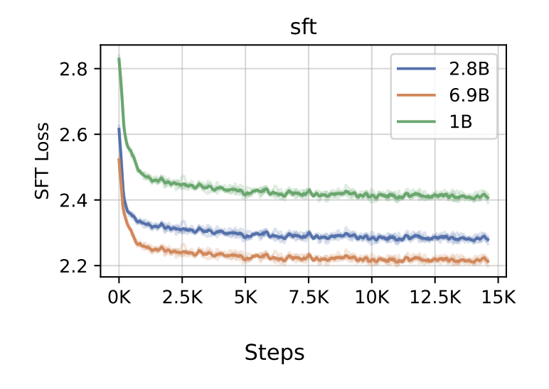

# RLHF Implementation from Scratch: Evaluation Results

## Overview

The goal of this analysis is to verify reproduction of results.

## Stage 1: Supervised Fine-Tuning (SFT)

### Training Setup
- Base model: Llama-XXX (vs paper's GPT-3)
- Dataset: Reddit TL;DR (XXX train examples)
- Key hyperparameters:
  - Learning rate: X.XX (paper: X.XX)
  - Batch size: XX (paper: XX)
  - Epochs: X (paper: X)
- Training time: X hours on [your GPU setup]

### Results

**Training curves:**

<table>
<tr>
<td></td>
<td></td>
</tr>
<tr>
<td align="center"><i>Reproduced SFT</i></td>
<td align="center"><i>Stiennon et al. (2020)</i></td>
</tr>
</table>

**Metrics:**
| Metric | Reproduced SFT | Paper SFT | 
|--------|--------|-----------|
| ROUGE-L | 0.2694 | ~0.2575 (est. based on figure) |

### Sample Outputs


<details>
<summary>Example 1 (click to expand)</summary>
**Example 1: [Brief topic description]**

**Original post:**
```
SUBREDDIT: r/AskReddit

TITLE: I hope you guys can help me out with me (former) best friend. I'm really counting on Reddit for this one.

POST: Long story short, her ex was an asshole to her in high school, she broke up with him, and then dated his best friend for a short time. When university started, she saw her ex again at uni, felt guilty because he said he had started doing drugs and drinking alcohol cuz of her. She starts dating him again; he emotionally and verbally abuses her, tells her that I'm an asshole who wants to use her etc. She stops talking to everyone until Christmas break. We (me, her sister, and other friends) convinced her to break up with him. And she did. But after going back to uni, she started having a thing with him again. This time, I lost my cool and got mad, yelled at her. She told me off, but I still apologized to her in March. A few hours ago, she emailed me saying she was happy with that asshole and I said that was good for her, but I was never going to forgive him (he  says he has cancer, no symptoms or proof to support it). I told her that he was not my concern anymore, blah blah blah. She told me I was being egoistic and needed to keep my anger away. Hence, making me sound like the bad guy. Now should I still work my way and try to save the friendship or should I just tell her off?

TL;DR:
```

**Reference summary (human):**
```
Best friend has been a bitch too me for a while, should I still apologize (again) and try saving friendship or tell her off?
```

**Base model (Llama-XXX):**
```
I'm really counting on Reddit for this one.

• I'm not sure what you're asking. – user253751 May 31 '18 at 19:03
• I'm asking if I should still work my way and try to
```

**My SFT:**
```
Ex boyfriend is an asshole, I'm not going to forgive him, she's not going to forgive me. Should I still try to save the friendship?
```

**Paper SFT (GPT-3):**
> Paper's output

</details>

<details>
<summary>Example 2 (click to expand)</summary>
**Example 1: [Brief topic description]**

**Original post:**
```
SUBREDDIT: r/AskReddit

TITLE: hey reddit, should i press charges?  waitress rage inside.

POST: sunday i went to lunch with a friend and two small children who are relatives.  we ate at johnny rockets.  our bill was 37.95, which i paid for with my credit card, and i left a 10 dollar cash tip - already over 25 percent!  the service was shoddy but it was busy and the waitress was super apologetic and i also wait tables so i know how it feels to be "in the weeds."  

checked my bank account online last night, saw a withdrawal for 52.95.  i immediately went to the restaurant and talked to a very confused but accommodating manager.  she disappeared for about 10 minutes, came out, asked us to go to the back.  we went to the back and she asks me if i left a 15 dollar credit card tip.  no way!  

she pulled up the original transaction, and the credit card report for that day, but she didn't have the receipt that i signed.  she's getting it; it's been sent out already.  i looked at the report and saw other transactions for that waitress that day with suspect tips; a 21 dollar bill with a 10 dollar tip and a few others.  it's only been a few days so i am sure other people will come forward if they check their bank accounts or balance their checkbooks.  

i should hear back today or tomorrow from the manager and she said she'd cooperate if i want to take this any further.  part of me knows times are tough, but you don't steal from people.  the other part of me is like don't fuck with the working class, miss lady.  i'm a server and i've never ever done this but i've seen it happen in other places.  i know she's going to lose her job over this, though.  

oh, and yes, i put a little dash in the tip amount line on the receipt and wrote 37.95 as the total.  this leads me to believe that she turned the little dash into a 5, made it 15.00, and rewrote the total.  i should have just wrote in "cash", lesson learned.  never thought this would happen.

TL;DR:

```

**Reference summary (human):**
```
left a 25%+ cash tip for a waitress, she wrote in more money on the receipt, thusly getting a 25 dollar tip on a bill for 37.95.
```

**Base model (Llama-XXX):**
```
waitress stole from me and i want to press charges.  i don't know if i should or not.
```

**My SFT:**
```
waitress stole from me, i want to press charges.  should i?  i'm a server and i've seen this happen before.
```

**Paper SFT (GPT-3):**
> Paper's output

</details>

<details>
<summary>Example 3 (click to expand)</summary>
**Example 2: [Reconnecting with ex after cheating]**

**Original post:**
```
SUBREDDIT: r/relationships
TITLE: Me [18M] with my ex gf [16F] 1 year, Started talking again and..
POST: So long story short i was the asshole that made me and my now ex gf break up about 6 months ago.
I cheated on her when i get way to messed up at a party, and i made the worst mistake of my life i feel like, i have been unable to forgive myself for doing that to her, and had been depressed and unable to even get out and do much since then
I cared quiet a bit about her and still checked up on her to make sure she was okay, but recently we lost contact for about 2 months and i was contacted by one of her friends because she was worried about the current relationship that my ex was in, apparently the guy told her he didn't want a label on there relationship because that was old fashioned, i found out from multiple lady friends of mine that he had been hooking up with there friends, telling them he was single.
long story short i texted her and basically spent a whole night talking to her on the phone trying to convince her of what he was doing, she finally talked to him about it and he finally admitted it, and she told him they needed to break up which they did.
Now i didn't expect anything to come to this but we have been talking a lot again, and we hungout today and we kissed and hugged for a long time, the thing is i don't know what to do reddit, i still hate myself for what i did and i wanted her back even though i knew i didn't deserve her, and now i still want her back but i'm in a dilemma, because i want to make sure i never do that to her again. And i also wanna make sure that she isn't just doing this cause shes lonely too.
Excuse my grammar i know it's bad
TL;DR:
```

**Reference summary (human):**
```
ex gf broke up with me then got into a bad relationship which i helped end, and we are talking again.
```

**Base model (Llama-XXX):**
```
I want to make sure i never do that to her again, and i want to make sure she isn't just doing this cause shes lonely too.
I'm not sure if this is the right place to post this, but i'm not sure
```

**My SFT:**
```
I cheated on my ex gf, she broke up with me, and now we are talking again, i don't know what to do reddit
```

**Paper SFT (GPT-3):**
> Paper's output

</details>

<details>
<summary>Example 4 (click to expand)</summary>
**Example 4: [Coworker emotional affair and relationship struggles]**

**Original post:**
```
SUBREDDIT: r/relationship_advice
TITLE: Co worker relationship [25/m] my girlfriend [24/f] my coworker [30/f]
POST: Hello all! Just a quick heads up this is a throw away for obvious reasons. Basically I want/need to talk about this situation I been having at work. Here is the back story. I currently live with my girlfriend we been together for about 3 years and been living with each other for the last 1.5. We moved in together to deal with the high rent of living in a big city. Things with us are overall great but we just don't have sex enough. I tired having many open talks about this but it seems to never change. It's frustrating and getting to the point where I question our relationship. So I been dealing with these personal issues but then something came up at work. This coworker of mine and I have recently developed this weird relationship where we talk dirty to each other. It started off small but has gotten very graphic over the last few weeks. We text each other every day during work about all types of things but never after work. She also has a boyfriend that she lives with. We have certain rules like: we will never have physical contact and like previously stated, no contact after work. It is only just talking but it gets us off because we shouldn't be doing it. Now it's getting to the point where I don't know where to turn. Should I dump my girlfriend whom I live with to find someone more sexually active. Or should I stay with her and keep this type of innocent/ naughty conversations on the side. I never dealt with something like this and it's really getting to me. Any input will help .
TL;DR:
```

**Reference summary (human):**
```
I have a girlfriend I live with who doesn't put out and j have a horny coworker who talks dirty to me
```

**Base model (Llama-XXX):**
```
I have a coworker and I have a girlfriend. We have been together for 3 years and we live together. We have been having a lot of open talks about our relationship but it seems to never change. I have been dealing with these personal
```

**My SFT:**
```
I have a coworker that I have been talking dirty to and I don't know if I should dump my girlfriend or stay with her.
```

**Paper SFT (GPT-3):**
> Paper's output

</details>

<details>
<summary>Example 5 (click to expand)</summary>
**Example 5: [Boyfriend hid billionaire wealth for 2 years]**

**Original post:**
```
SUBREDDIT: r/relationships
TITLE: Me [23 F] with my boyfriend [24 M] of 2 years, just found out he's nearly a billionaire.
POST: I've been dating my boyfriend for a while now.  Around 2 and a half years.  
  
All this time he's been lying to me though.  He's basically been keeping his wealth hidden and pretending to work while I've worked my ass off every day.  
  
We moved in together about half a year ago and I quickly noticed that he spent money often and on a lot of stupid stuff.  I just thought he was bad with money, but he never seemed to run out and always seemed to be happy to pay for stuff when I let him.    
 
Anyways, I thought he always worked part time at some small computer shop across town.  As it turns out, he does, but he just does it for fun since he doesn't really need money. 
Also, he actually OWNS this computer shop.  
  
He told me this today while also admitting that he's got something like 870 million in his name.  
  
I'll admit I googled his name once or twice, but it was essentially a failure since he's got a really common name shared with a bunch of people.  Once I googled how he earned his money, I basically confirmed that he is actually rich as shit.  
  
He says he did it because he wanted to make sure I didn't like him just for his money, which I get completely.  I just can't get rid of that feeling that I've been lied to for our entire relationship.  
  
How do I move past this?  Is it alright for me to be upset?
TL;DR:
```

**Reference summary (human):**
```
Boyfriend kept his wealth hidden from me by lying, is it OK in this situation?  How do I move past it?
```

**Base model (Llama-XXX):**
```
I've been dating my boyfriend for a while now.  Around 2 and a half years.  
  
All this time he's been lying to me though.  He's basically been keeping his wealth hidden and pretending to work while I've worked my
```

**My SFT:**
```
Boyfriend is a billionaire and I'm upset that I've been lied to for the past 2 years.  How do I move past this?
```

**Paper SFT (GPT-3):**
> Paper's output

</details>

---

### Analysis

**Training dynamics:**
- My loss curve shows [convergence pattern, comparison to paper]
- Key differences: [e.g., faster/slower convergence, final loss]
- Possible reasons: [model size, dataset processing, hyperparameters]

**Output quality:**
- Qualitative improvements over base: [what improved]
- Comparison to paper: [where you match, where you differ]
- Common patterns: [e.g., length, style, content selection]
- Failure modes: [where SFT struggles]

**Reproduction assessment:**
- ROUGE-L: [within X% of paper, discuss if meaningful]
- Loss trajectory: [similar/different patterns]
- Qualitative comparison: [subjective assessment]
- Hypothesis for differences: [model architecture, dataset size, etc.]