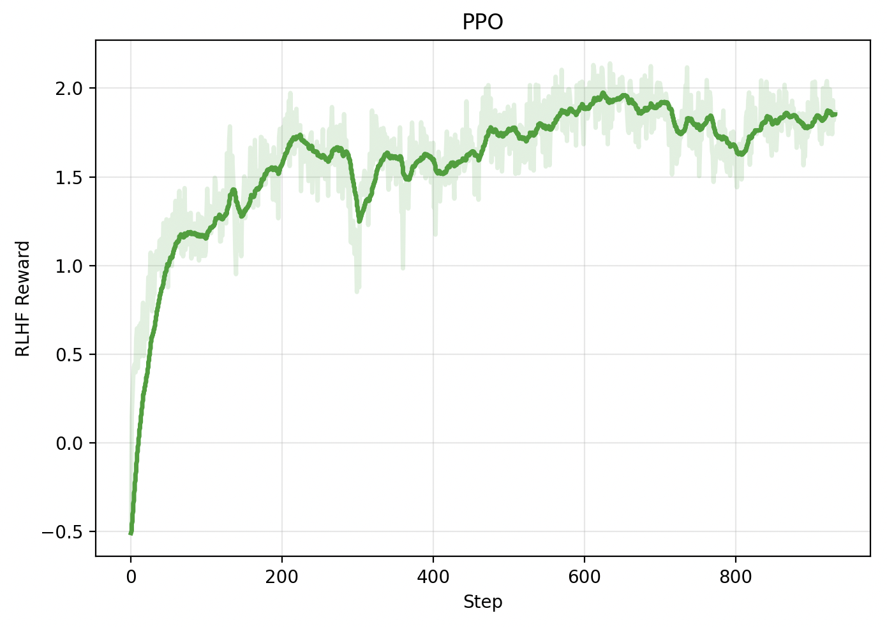
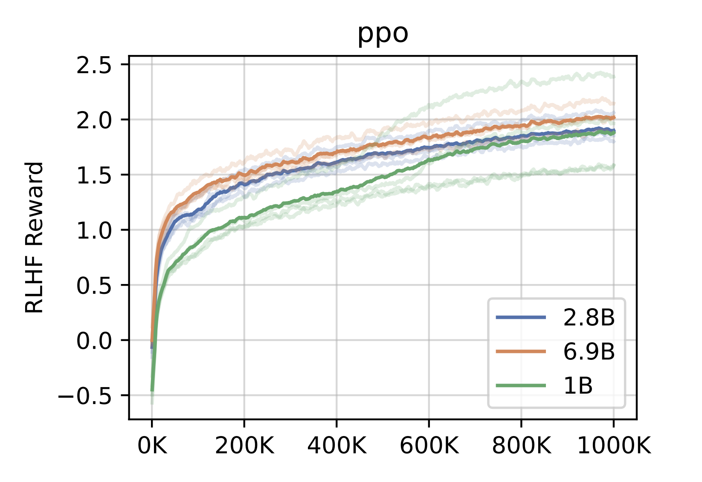
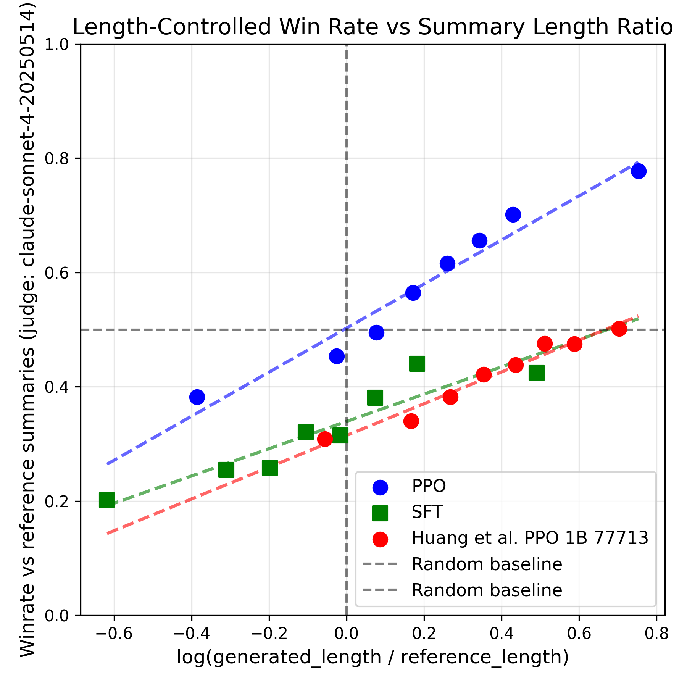

# r/RLHF_from_Scratch

## TL;DR:  

Human (Me) Summary

> I wanted to do the stupid thing and implement RLHF from scratch for fun and to learn. I picked this paper [[1]](REFERENCES.md#ref1) on a summarization task, struggled for a while, learned cool things, got something that looked right, then spent more time to [convince myself I'm right](eval.md). I did some meta-reflecting on some meta-things-I-did-well and some meta-lessons, asked an LLM to tell me I did good, and want to build more. 


Reproduced RLHF Model Summary 
> An implementation of reinforcement learning from scratch using PPO algorithm and wanted to make the code largely readable through design rather than comments about using LLMs as development tools. Performed well for about 50 steps then quickly degrading. Found facepalm bug where was overloading parameter name effectively setting value coefficient incorrectly. Results are comparable to and even exceed Huang et al. Any improvements may be statistically significant but are likely attributed to a stronger base model (Llama vs Pythia)? Optimize iteration speed?
- *Note: This post exceeds max query length of the model so I did some summary-of-summary hacking and added punctuation. This example is very out of distribution for the model and just for fun. For better examples, see the [evaluation](eval.md).*


## Intro 
*Why build from scratch*, you ask? Great question. Implementing reinforcement learning is notoriously hard, and some might say that "writing things from scratch is the most catastrophically self-sabotaging thing you can do" [[2]](REFERENCES.md#ref2). The goal was simply to have learn and have fun. It is easy to skim a paper and say that you know how it works, but the active learning from struggling and debugging, and satisfaction of understanding from first principles are entirely different when building from scratch. I also enjoy working on the problems found in the bridge between research and practical implementation, because, well, its cool.

*What was not a goal?* I want to quickly acknowledge that if the immediate goal was to get validate a research idea, this is not the approach I would take unless critically necessary. The time and effort it takes to implement from scratch is at direct odds with the initial need to rapily invalidate or gather supporting evidence for a research idea. Repurposing or extending an existing, battle tested library or repo would be a better way to go. I also did not intend to replicate the scaling laws investigated in [[1]](REFERENCES.md#ref1), only the results.  


## [Before] Project Design and Implementation Decisions
### What paper should I choose?
Since there is no single source of truth paper for RLHF, there were a lot of options of papers to pick [[3]](REFERENCES.md#ref3)[[4]](REFERENCES.md#ref4)[[5]](REFERENCES.md#ref5)[[6]](REFERENCES.md#ref6)[[7]](REFERENCES.md#ref7)[[8]](REFERENCES.md#ref8). I decided on [[1]](REFERENCES.md#ref1), as the authors include significant details, which eliminates a lot of ambiguity from both training but more importantly evaluation.  

### Code System Design
Given my background in engineering, I often find research code to be less than elegant. RL systems are particularly difficult, as they are more challenging to simplify and abstract [[2]](REFERENCES.md#ref2). So, a goal of mine was to *make the code largely readable though design rather than comments*. I wanted to be able to look at the code for the PPO algorithm and for to feel as readable as pseudocode, and to feel like I can recursively zoom in on a detail by looking at a function definition and read it like pseudocode. 

### On Using LLMs as Development Tools

I'm dedicating space to this because LLMs are and will continue to be part of the development process for engineers, but there is the very real concern (especially in elementary education) that people let LLMs do think for them. The goal was to use LLMs for as tools, rather than them using me as a tool. Here are some examples of ways that I used LLMs:

**How I used LLMs:**
- [Feedback] I'm considering designing a profiling tool as a decorator, but on initial thought it is hard to track state over multiple or recursive calls. Is there a paradigm I haven't thought of that would allow for a better design?
- [Teacher] What is the difference between reserved and allocated GPU memory?  
- [Search/Documentation] How do the HF Llama models when used as a sequence classifier extract the reward? Can you find me the source code that can verify your answer?
- [Intern/Few Line Code Monkey] Can you write me a few lines of code showing me how I would structure and send a request to the Claude API?
- [Basic Debugging] I have this stack trace and error message I don't recognize or understand, what could be the issue?
- [Idea Generation / Rubber Ducking] My best idea for why this function is taking forever was GPU/CPU I/O, but my profiling says this trivial tensor operation takes 10x longer than a forward pass, which makes no sense. 
- [Editor] Can you make this sentence / paragraph grammatically correct and sound slightly more professional?
- [Encouragement] Tell me I'm pretty.

**How I _didn't_ use LLMs**
- [Copy+Paste/Delegation] Can you implement the PPO training loop for me?
- [Complex Debugging] Here is all my code, now tell me why my reward isn't going up.


**Mini-discussion:**

*Okayyyy* I will admit that at times I got lazy and tried the things I said I didn't do. But, I often found that using LLMs in this way was actively detrimental, not just for learning but moreso it just didn't work.
- When LLMs tried to write too much code for you, I often find many more bugs. Even if it was bug free, I often found it to be structured in a way that I thought was bad, and I spend more time fixing it. Better to come up a design --> ask for feedback ~= a quick stamp --> write the pseudo code --> recursively break into smaller, abstracted chunks == functions --> if non-essential or non-informative, and E[num lines of code] < 10, ask LLM to take a stab at it.
- When dumping info into an LLM and asking it to do complex debugging it could sometimes point out basic errors say within a function (maybe, "you flipped this sign") but it struggled more to reason about complex interactions in the system (cant do "you made this choice here, and it looks fine in these intermediate steps, but that ultimately affects this thing way over here")
- Similarly when I found myself letting it lead the debugging investigation, it often ran in circles, chased things down rabbit holes that didn't make sense or were at least not the logic next place to check. It's easy to get in this mode, similar to when its easy to just do a sort of guess and check coding when you wait for the code to compile and run to tell you where the next error is. Instead, its much more efficient to use use your head.

Ultimately, I verified all LLM code generated in the training loops by walking through it myself. Well, sometimes in eval code I would briefly skim then verified the correct output, for things like plotting graphs.

### Don't look at reference implementation until evaluation
I made the choice not to look at reference implementations until evaluation, which is also ill advised [[2]](REFERENCES.md#ref2) but I felt that I would learn more without a cheat sheet. Then I switched around few small details which are noted in the code. At evaluation, the reference implementation was used mainly to identify details that may make direct comparisons different. 

## [During] The hard stuff - I now present the Paper Plate Awards for fun challenges and technical lessons

### 🏅 [Biggest Ohhhhh Moment] - Why is KL not zero before any update step is made? 
**The Symptom** KL divergence was rising quickly during training, but more concerning was that it didn't start at zero. Since the policy and reference models should be identical before any updates, this violated a basic sanity check.

**The Debugging Process** I started with the obvious candidates, like if I was logging KL before the first update step, and if the models were recieving the same inputs. When I visually examined the raw logits, I noticed a significant portion with zero probability (actually, -infs was the default mask from the model). From here I realized the model was using top-p sampling and probability masking during generation, but these weren't applied during the forward pass I was using for KL computation.

**The Bug** Generation-time behavior differs from forward-pass behavior due to sampling parameters like `top_p` and `temperature`. I was comparing distributions that weren't actually aligned:
- KL between `policy_logits` and `ref_policy_logits` was computed over different support sets
- Entropy calculations were incorrect for the same reason  
- Training-time forward passes were inconsistent with rollout-time generation

**The Fix** Instead of trying to perfectly replicate generation behavior in the forward pass (controlling for top-p, temperature, masking, etc.), I added a separate forward pass on the generated sequences. While this adds overhead, it's negligible - generation takes ~50x longer due to autoregressive decoding across 50 tokens.

**The Technical Lesson**
In the process, I learned a lot about sources of randomness


### 🥇 [Longest Time Spent Head-Banging] - State-Action Alignment
**The Symptom** The initial symptom was that PPO training was seeing immediate and accelerating drops in rewards.

**The Debugging Process** After ruling out all of my initial hypotheses, I was clueless and started debugging by system component. I verified (with lots of analysis) that the reward model (and hence the value) was functioning correctly, and similar for the sft model. I completely eliminated issues with MSE loss / the value function pathway by showing that the policy degraded before the value model was updated, hence it can have no influence on the policy model. I broke down each component of the policy loss (ratios and advantages, which is further broken down into values, rewards, returns, and kl) and inspected them, finding a few small bugs along the way. Once the issue was narrowed down to the GAE calculation (which I had checked multiple times), I eventually realized that there was a discrepancy with what the LLM outputs for each step. 

**The Bug** 
At time t, the models will output the desired state and value. However, the (softmaxed) logits describe the distribution over the actions considered/taken at time t, which is equivalent to the state at time t+1. The advantage is how much better an _action_ is than expectation, it should be aligned to the actions as well. The reward model by default outputs rewards at EOS tokens, but it describes how good the _action_ of the eos token was, hence rewards are also misaligned. The correct alignment is as follows:

```
       ----State Indexing---- (len = seq_len)
        Position:            0         1         2        3        4
        states:          [prompt,   token1,   token2,    EOS,     PAD]
        pad_mask:        [   1,        1,        1,       1,       0 ]
        values:          [  V0,       V1,       V2,      V3,      V4 ]

        ----Action Indexing---- (len = seq_len-1)
        Position:            0         1         2        3
        actions:         [token1,   token2,    EOS,     PAD]
        logits:          [   L0,       L1,      L2,      L3 ]
        log_probs:       [  lp0,      lp1,     lp2,     lp3 ]
        rewards:         [    0,        0,      +1,       0 ]
        reward_mask:     [    0,        0,       1,       0 ]
        advantages:      [   A0,       A1,      A2,      A3 ]
        action_pad_mask: [    1,        1,       1,       0 ]
```

**The Technical Lesson** 
I knew this before, but RL off-by-one errors fail silently and are a common source of error - the GAE code was correct. But I re-learned a similar lesson the hard way - there is a similar problem with autoregressive models, which have a similar structure of dependency on adjacent states. So, having a nuanced understanding of what each value at a given step t represents is crucial, and doubly important for RL x autoregressive tasks. 


### [Hardest to kill bug] - Masking, everything, everywhere, all at once
Masking can easily cause issues everywhere. Recall that we need masking not just for attention in forward passes, but also for padding in pretty much all following computations, as well masking non-reward positions. All functions with any aggregation need to take into account masking - mean, var, softmax, whitening, etc. Additionally, the tricky alignment of state and action tensors mentioned previously means we need be mindful align the masking properly as well. These obsevations apply to both computations in the training loop, as well as all logging statistics. These are also had to see in model performance, since the symptoms can be subtle - the magnitudes of a metric are a little off, model outputs seem weird (repetition of the user or prompt), metrics seem good but samples suck, etc. I learned a lot and had to think much more deeply about nearly every tensor operation, gradient graphs and flow, general statistical reporting, etc.


### 🏆 [Most Fun][Most Informative] - Scaling, just in general
**Memory**
Memory is the biggest constraint in RLHF, as there are multiple models / sets of weights in working memory - policy model, value model, reward model, sft model, old policy model or weights, old value model or weights. Even bigger memory footprints come from the gradients and optimizer states from the policy and value models. A few massive tensors can also cause bottlenecks, for instance both policy and sft logits are (batch_size x sequence_length x vocab_size x dtype_size) >7GB memory each. Also, ballparking memory footprint beforehand was a really fun exercies in both estimation math but also in 

I'll quickly run through some memory optimizations I considered or used 

- Mixed precision training - first though fp16 context and a loss scalar, but eventually discovered and used bf16. 
- Gradient accumulation - allows for smaller batches in working memory. However, note that this doesn't work reduce memory footprint in PPO 
- Gradient checkpointing - instead of saving all the gradients in memory, recompute some at backward pass time. This is a direct tradeoff of time for memory. Percentage of gradient memory saved is proportional to layers are checkpointed vs recomputed. Backward pass time also increases proportionally, but in RLHF generation is still the bottle neck (if forward = 1x, backwards = 2-3x, generation is (reponse_length)x). 
- Cleaning tensors in the right places - compared to some single function implementations, garbage collection from abstracted code can help, but around the bottlenecks, strategically ordering operations and deleting tensors can prevent memory spikes
- Memory fragmentation mitigation - helps manage reserved but not allocated memory. Can optimize and coallesce fragments of unallocated, reserved memory into one segment that can be allocated for different use cases at different points in the training loop.
- Tooling - extending a profiler tool to include memory helps for quickly locating bottlenecks
- Mindful loading of models with .eval, requires_grad(False), and/or with torch.no_grad to save memory usually occupied by activations, gradients and optimizer states, for instance on SFT and old policy and value models (actually for the latter two, you only need the weight/state dict in memory).
- In place tensor operations eliminate unnecessary overhead


**Time**
As stated previously, the largest bottleneck is usually generation, as the autoregressive nature makes the time similar to running a forward pass per token generated. I/O can be a bottleneck when working with distributed training. Saving checkpoints too frequently is a common one. Its possible to create another big bottleneck if you don't tokenize and cache the data ahead of time, or try to do too many non-gpu supported opperations like strings ops on the data during the training loop.


**_Next_ Time**
- I did not use ZeRO, but this would be medium to easy to implement if using accelerator as Huang et al. did. This would be the next step to allow scaling to models up to maybe 10B. But it would be fun to build it from scratch...
A few things I want to try but discovered a bit too late to be worth it:
- Compiling pytorch (via something like `torch.compile()`) to my understanding JIT-compiles the pytorch computation graph, which allows further optimization, with things like fusing ops or generating optimized cpp / kernels. 
- Flash attention (via something like `attn_implementation="flash_attention_2", ` as an argument in LlamaForCausalLM.from_pretrained), which an LLM told me alleviates the quadratic _memory_ (not time) constraint, which also achieves a wall-clock speedup.


### 🥈 [I'm glad I didn't have to build that] - Mixed Precision (FP16) Causing Infinite Gradients
Infinite gradients showed up, but were harder to isolate than usual. The forward pass was stable, but backward gradients through the exp() operation in PPO ratio calculation `r = torch.exp(new_log_probs - old_log_probs)` overflowed in FP16, primarily caused by grad scalar- but it really seemed like these numbers weren't that unreasonably big, so I started questioning why FP16 had such a small dynamic range, thought about building a datatype, which led me to discover BF16. 

I learned a lot about how mixed precision training works, led me to think more deeply about different floating point representations


### 🥉 [Biggest Facepalm] - Policy Degredation
The policy performed well for about 50 steps, then started quickly degrading. This feels like a classic hyperparameter tuning problem (reduce learning rate?), but I treated it like a bug, isolating where in the system the instability originated and to where it propagated. I eventually found a facepalm bug where I was overloading a parameter name, effectively setting the value coefficient incorrectly. While all the symptoms were correctly indicative of required hyperparameter tuning, the bug was implementation level. I learned (thankfully the easier way) that debugging treating what felt like hyperparameter tuning issues initially as a bug is significantly faster. 


## [After] Results and Eval Summary

Overall, results are comparable to and even exceed Huang et al. Any improvements statistically significant _but_ are likely attributed to a stronger base model (Llama vs Pythia). For a more detail eval used to convince myself I'm right, look [here](eval.md). Notable observations include reward hacking via title copying, which also appear in some of the samples shown in Huang et al..

**Key Results:**
- **SFT:** ROUGE-L of 0.2694 vs. ~0.2575 (original)
- **Reward Model:** 69.5% validation accuracy vs. ~63% (original) and 73.4% judge agreement vs. 37.3% (original)
- **PPO:** Length-controlled win rates comparable to original 1B curves, with similar training dynamics but lower policy entropy and early evidence of reward hacking via title copying (TODO: ~X% of outputs) 

<table  align="center">
<tr>
<td></td>
<td></td>
</tr>

<tr>
<td align="center"><i>Reproduced PPO (exponential smoothing α = 0.92)</i></td>
<td align="center"><i>Huang et al. (2024)</i></td>
</tr>
</table>


<table  align="center">
<tr>
<td></td>
<td></td>
</tr>
<tr>
<td align="center"><i>Reproduced PPO</i></td>
<td align="center"><i>Huang et al. (2024) 1B, seed 77713. Red and blue are PPO </i></td>
</tr>
</table>


## Reflections + Meta-Lessons

I think some of these have been said before, but it just validates their importance:

- **Assume a bug rather than tune hyper parameters** - I've seen this advice before, but this served me well. I could have spent weeks trying to tune stuff to fix policy degredation (which never would have worked) when I just had to track down a one line bug.
- **Invest in accelerating iteration speed** - This is always a good idea, but in ML/RL in particular this is essential. Anything to minimize time between trying and verifying a fix, since realistically that's 90% of what time is spent on. If time spent waiting for fix > time spent coding + implementing... then alert! Time to spend more time thinking about how you can accelerate runtime, or think more about this next thing: In particular, how quick is your own feedback cycle? Does it take you seconds, minutes, or hours to figure out if you made a mistake? Optimizing this is arguably more important than optimizing runtime, at least when the projected naive full training run is measured in hours, but the project timeline is measured in months. One concrete way to action on this is reducing program startup time- caching data mapping, saving models in efficient formats, etc. Or better yet, reduce the number of times you run a program. Debuggers over a naive print statement debugging method pay back n-fold; work with your environment before. Build or use tools that help you find bugs quickly (time/memory profiler, wall clock, ). 
    - **Unit testing** - I did a lot of the above, but I wish I tried building unit tests, at least for important, deterministic parts like GAE computation and loss calculations. 
- **Systematic, hypothesis-driven debugging** - Be very deliberate and intentional with how you search for bugs. When problems persist after eliminating all obvious and some non-obvious possibilites, and you're genuinely stumped, something like component-wise or binary search debugging served me well. Find a way to test if the bug is in a certain part of the system or occurs before / after a certain place in the training loop. I did this when looking for the source of what turned out to be state-action tensor alignment issues, and it served me better than checking more and more obscure and outlandish hypotheses.
- **Just use your brain** Even more experienced developers can succumb to the path of least resistance and fall into a  guess-and-check loop, but this often takes too many iterations. And as it make take minutes to the first hit on that line, or hours until metrics become readable, this is extra costly. Its usually more efficient to use the brain and developing a testable hypothesis that will either be rejected or accepted. I often ask myself "how can I prove myself wrong". Similarly, knowing where to take the sidequests is important. How likely is it to further progress? Or discover crucial bug, or contribute to the requirements?
    - Sidenote: the quick dopamine guess-and-check loop also exists for using LLMs. Sometimes they can help, but just as easily they can send you into a spirl down a path you know to be useless.
- **Why ML, RL is ~extra~ hard** I like this [[9]](REFERENCES.md#ref9) explanation of why ML is hard; it shows different dimensions of issues that can occur, causing exponential integration hell. But I want to extend this idea - there's an invisible, shadown dimension between each of these dimensions, which is your understanding. I think of it like this: Algorithm --> Your understanding of said algorithm --> Your actual implementation of that algorithm. It can be easy to look at an implementation and say "yea thats right", but your baseline for comparison is just wrong. If you're so convinced you're right in one area, you're less likely to look in that area.


## Whats next? - Things I want to do but didn't do 
- Implement ZeRO from scratch
- Compare to DPO, RLAIF, other types of RLHF
- Try ablating post titles in the training data and compare performance, reward hacking
- Make it even more from scracth - do GPT from scatch (but training would be $$$, and data access might be a limitation)
- It was my original intention to do this on alignment datasets and problems


